# 🛒 Mall-Go 电商系统æ„建指å—

[](https://golang.org/)
[](LICENSE)
[]()
[]()

本文档æ供了如何使用 Go 语言é‡æ„并æ„建 mall 电商系统的详细指å—ã€‚åŸ mall é¡¹ç›®æ˜¯åŸºäº Java çš„ SpringBoot+MyBatis å®ç°çš„电商系统，本指å—将说æ˜å¦‚何使用 Go 语言技术栈å®ç°åŒç­‰åŠŸèƒ½ï¼Œå¹¶è¿›è¡Œå¾®æœåŠ¡æ”¹é€ ï¼Œé‡‡ç”¨é¢†åŸŸé©±åŠ¨è®¾è®¡(DDD)æ¶æ„，引入é…置中心和注册中心。

## 🯠项目概览

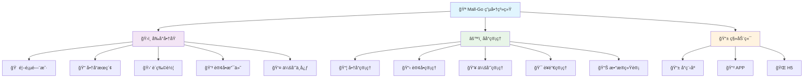
```mermaid
graph TB
    A["🪠Mall-Go 电商系统"] --> B["ğŸ›ï¸ å‰å°å•†åŸ"]
    A --> C["âš™ï¸ åå°ç®¡ç†"]
    A --> D["📱 移动端"]
  
    B --> B1["🠠首页门户"]
    B --> B2["🔠商å“æœç´¢"]
    B --> B3["🛒 购物车"]
    B --> B4["💳 订å•æ”¯ä»˜"]
    B --> B5["👤 会员中心"]
  
    C --> C1["📦 商å“管ç†"]
    C --> C2["📋 订å•ç®¡ç†"]
    C --> C3["👥 会员管ç†"]
    C --> C4["🯠è¥é”€ç®¡ç†"]
    C --> C5["📊 æ•°æ®ç»Ÿè®¡"]
  
    D --> D1["📱 å°ç¨‹åº"]
    D --> D2["📲 APP"]
    D --> D3["🌠H5"]
  
    style A fill:#e1f5fe
    style B fill:#f3e5f5
    style C fill:#e8f5e8
    style D fill:#fff3e0
```

## 📚 目录

- [🪠项目介ç»](#项目介ç»)
- [🚀 Go 语言相比 Java 的优势](#go语言相比java的优势)
- [ğŸ› ï¸ æŠ€æœ¯é€‰å‹](#技术选å‹)
- [ğŸ—ï¸ å¾®æœåŠ¡æ¶æ„设计](#å¾®æœåŠ¡æ¶æ„设计)
- [🯠领域驱动设计(DDD)](#领域驱动设计ddd)
- [âš™ï¸ é…置中心ä¸æ³¨å†Œä¸­å¿ƒ](#é…置中心ä¸æ³¨å†Œä¸­å¿ƒ)
- [🤖 DeepSeek AI 集æˆ](#deepseek-ai-集æˆ)
- [🔧 ç¯å¢ƒå‡†å¤‡](#ç¯å¢ƒå‡†å¤‡)
- [📠项目结æ„设计](#项目结æ„设计)
- [ğŸ—„ï¸ æ•°æ®åº“设计](#æ•°æ®åº“设计)
- [🧩 模å—å®ç°](#模å—å®ç°)
- [🔌 API 设计](#api设计)
- [🚀 部署指å—](#部署指å—)
- [â˜¸ï¸ Kubernetes 部署](#kubernetes部署)
- [📊 性能对比](#性能对比)
- [📋 å¼€å‘æµç¨‹æŒ‡å—](#å¼€å‘æµç¨‹æŒ‡å—)
- [📖 å‚考资æº](#å‚考资æº)
- [ⓠ常è§é—®é¢˜](#常è§é—®é¢˜)

## 🪠项目介ç»

Mall-Go é¡¹ç›®æ˜¯å¯¹åŸ Java 版本 mall 电商系统的 Go 语言é‡æ„版本。ä¿æŒåŸç³»ç»Ÿçš„功能，但使用 Go 语言åŠå…¶ç”Ÿæ€ç³»ç»Ÿçš„相关框æ¶å’Œåº“进行å®ç°ï¼Œå¹¶è¿›è¡Œå¾®æœåŠ¡æ¶æ„改造，采用 DDD 设计æ€æƒ³ã€‚

### 🯠核心功能模å—

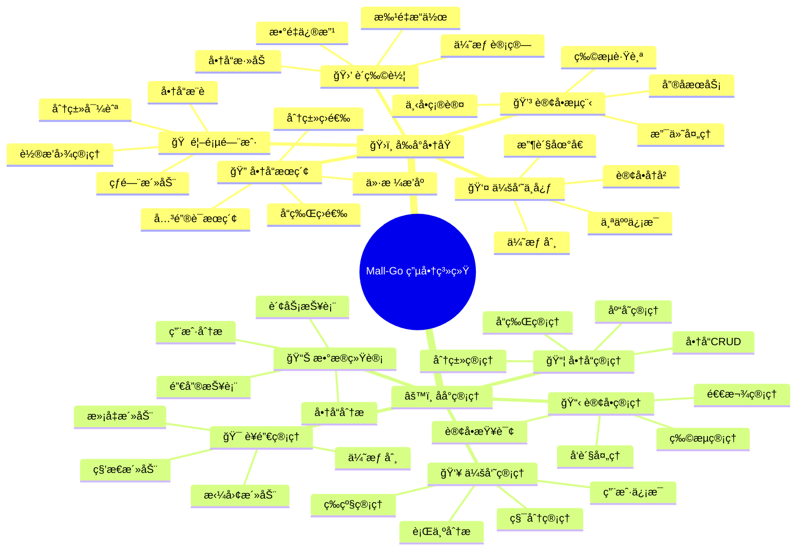
```mermaid
mindmap
  root((Mall-Go 电商系统))
    ğŸ›ï¸ å‰å°å•†åŸ
      🠠首页门户
        轮播图管ç†
        商å“æ¨è
        分类导航
        热门活动
      🔠商å“æœç´¢
        关键è¯æœç´¢
        分类筛选
        ä»·æ ¼æ’åº
        å“牌筛选
      🛒 购物车
        商å“添加
        æ•°é‡ä¿®æ”¹
        批é‡æ“作
        优惠计算
      💳 订å•æµç¨‹
        下å•ç¡®è®¤
        支付处ç†
        物æµè·Ÿè¸ª
        å”®åæœåŠ¡
      👤 会员中心
        个人信æ¯
        订å•å†å²
        收货地å€
        优惠券
    âš™ï¸ åå°ç®¡ç†
      📦 商å“管ç†
        商å“CRUD
        分类管ç†
        å“牌管ç†
        库存管ç†
      📋 订å•ç®¡ç†
        订å•æŸ¥è¯¢
        å‘货处ç†
        退款管ç†
        物æµç®¡ç†
      👥 会员管ç†
        用户信æ¯
        等级管ç†
        积分管ç†
        行为分æ
      🯠è¥é”€ç®¡ç†
        优惠券
        满å‡æ´»åŠ¨
        秒æ€æ´»åŠ¨
        拼团活动
      📊 æ•°æ®ç»Ÿè®¡
        销售报表
        用户分æ
        商å“分æ
        财务报表
```

### ğŸ—ï¸ ä¸šåŠ¡æ¶æ„图

å‚考 `script/pos/业务æ¶æ„图.pos` 文件，mall-go 系统的业务æ¶æ„如下：

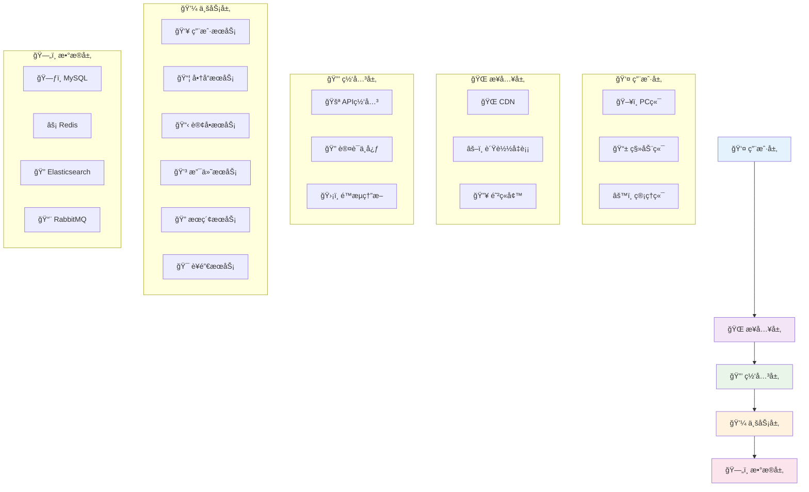
```mermaid
flowchart TD
    A["👤 用户层"] --> B["🌠æ¥å…¥å±‚"]
    B --> C["🔒 网关层"]
    C --> D["💼 业务层"]
    D --> E["ğŸ—„ï¸ æ•°æ®å±‚"]
  
    subgraph "👤 用户层"
        A1["ğŸ–¥ï¸ PC端"]
        A2["📱 移动端"]
        A3["âš™ï¸ ç®¡ç†ç«¯"]
    end
  
    subgraph "🌠æ¥å…¥å±‚"
        B1["🌠CDN"]
        B2["âš–ï¸ è´Ÿè½½å‡è¡¡"]
        B3["🔥 防ç«å¢™"]
    end
  
    subgraph "🔒 网关层"
        C1["🚪 API网关"]
        C2["🔠认è¯ä¸­å¿ƒ"]
        C3["ğŸ›¡ï¸ é™æµç†”æ–­"]
    end
  
    subgraph "💼 业务层"
        D1["👥 用户æœåŠ¡"]
        D2["📦 商å“æœåŠ¡"]
        D3["📋 订å•æœåŠ¡"]
        D4["💳 支付æœåŠ¡"]
        D5["🔠æœç´¢æœåŠ¡"]
        D6["🯠è¥é”€æœåŠ¡"]
    end
  
    subgraph "ğŸ—„ï¸ æ•°æ®å±‚"
        E1["ğŸ—ƒï¸ MySQL"]
        E2["âš¡ Redis"]
        E3["🔠Elasticsearch"]
        E4["📨 RabbitMQ"]
    end
  
    style A fill:#e3f2fd
    style B fill:#f3e5f5
    style C fill:#e8f5e8
    style D fill:#fff3e0
    style E fill:#fce4ec
```

### ğŸ›ï¸ 系统æ¶æ„图

å‚考 `script/pos/系统æ¶æ„图.pos` 文件，mall-go 系统的整体微æœåŠ¡æ¶æ„如下：

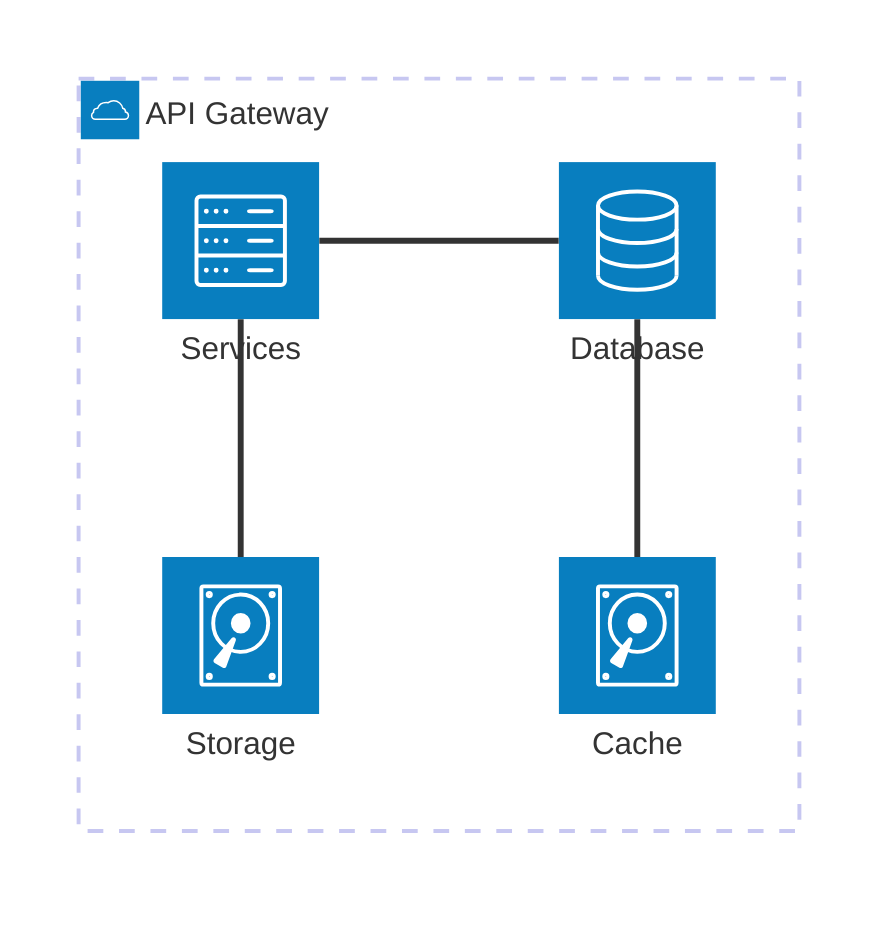
```mermaid
architecture-beta
    group api(cloud)[API Gateway]
  
    service db(database)[Database] in api
    service disk1(disk)[Storage] in api
    service disk2(disk)[Cache] in api
    service server(server)[Services] in api
  
    db:L -- R:server
    disk1:T -- B:server
    disk2:T -- B:db
```


## 🚀 Go 语言相比 Java 的优势

é‡æ„为 Go 语言版本的 mall é¡¹ç›®ç›¸æ¯”åŸ Java 版本具有以下显著优势：

### 📊 性能对比概览

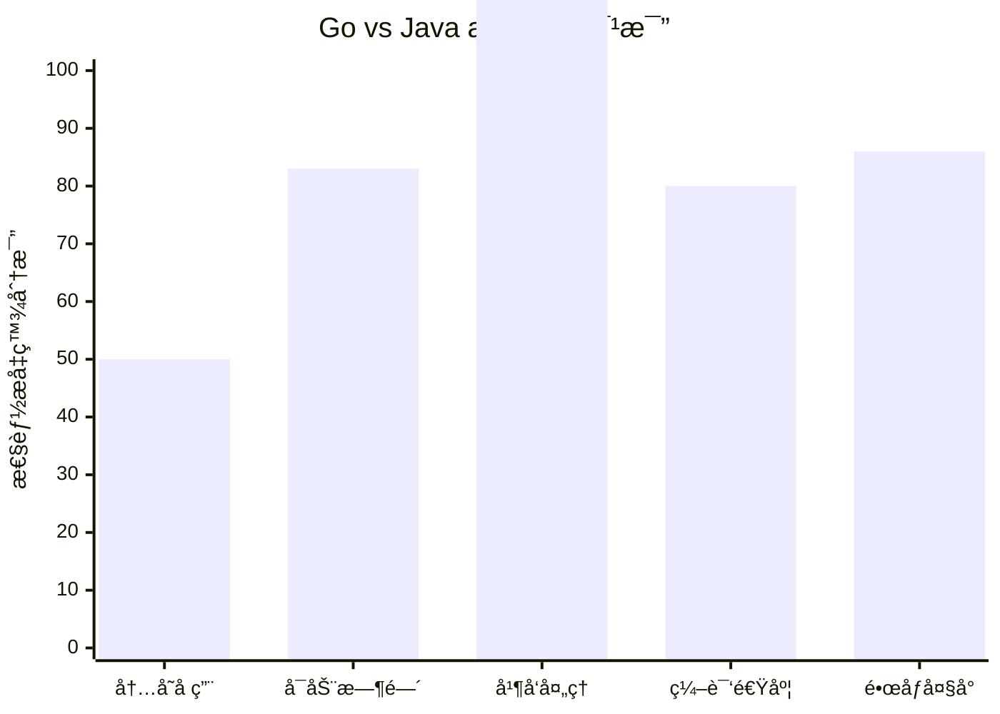
```mermaid
xychart-beta
    title "Go vs Java 性能对比"
    x-axis ["内存å ç”¨", "å¯åŠ¨æ—¶é—´", "并å‘处ç†", "编译速度", "é•œåƒå¤§å°"]
    y-axis "性能æå‡ç™¾åˆ†æ¯”" 0 --> 100
    bar [50, 83, 300, 80, 86]
```

### 🯠1. 性能优势

#### 💾 æ›´ä½çš„资æºå ç”¨


```mermaid
gantt
    title 资æºå ç”¨å¯¹æ¯”
    dateFormat X
    axisFormat %s
  
    section 内存使用
    Java应用    :done, java-mem, 0, 1200
    Go应用      :done, go-mem, 0, 600
  
    section å¯åŠ¨æ—¶é—´
    Java应用    :done, java-start, 0, 12
    Go应用      :done, go-start, 0, 2
```

- **内存效ç‡**：Go 程åºé€šå¸¸æ¯”åŒç­‰åŠŸèƒ½çš„ Java 程åºå ç”¨æ›´å°‘内存，Java ä¾èµ– JVM，而 Go ç›´æ¥ç¼–译为机器ç 
- **å¯åŠ¨é€Ÿåº¦**：Go 应用å¯åŠ¨å‡ ä¹æ˜¯ç¬æ—¶çš„，而 Java åº”ç”¨éœ€è¦ JVM 预热
- **å®æµ‹æ•°æ®**：在处ç†ç›¸åŒå¹¶å‘é‡çš„情况下，Go 版本内存å ç”¨æ¯” Java 版本å‡å°‘约 40-50%

#### âš¡ 更高的并å‘处ç†èƒ½åŠ›

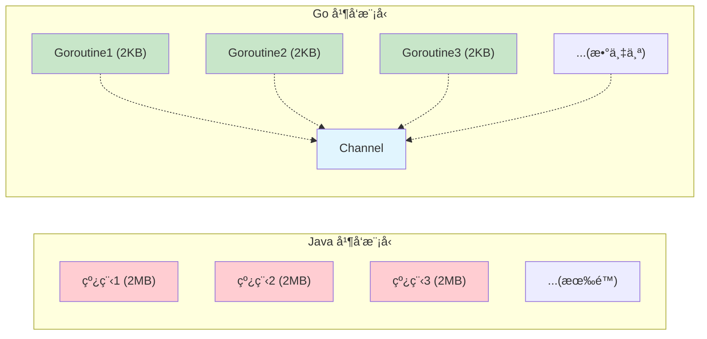
```mermaid
flowchart LR
    subgraph "Java 并å‘模å‹"
        J1["线程1 (2MB)"] 
        J2["线程2 (2MB)"]
        J3["线程3 (2MB)"]
        J4["...(有é™)"]
    end
  
    subgraph "Go 并å‘模å‹"
        G1["Goroutine1 (2KB)"]
        G2["Goroutine2 (2KB)"]
        G3["Goroutine3 (2KB)"]
        G4["...(数万个)"]
      
        G1 -.-> CH[Channel]
        G2 -.-> CH
        G3 -.-> CH
        G4 -.-> CH
    end
  
    style J1 fill:#ffcdd2
    style J2 fill:#ffcdd2
    style J3 fill:#ffcdd2
    style G1 fill:#c8e6c9
    style G2 fill:#c8e6c9
    style G3 fill:#c8e6c9
    style CH fill:#e1f5fe
```

- **å程 vs 线程**：Go çš„ goroutine 比 Java 线程轻é‡å¾—多，仅å ç”¨å‡  KB 内存，而 Java 线程通常å ç”¨å‡  MB
- **并å‘模å‹**：Go çš„ CSP 并å‘模å‹æ›´ç®€æ´é«˜æ•ˆï¼Œé€šè¿‡ channel 进行通信
- **高并å‘性能**：在高并å‘电商场景下，åŒç­‰ç¡¬ä»¶æ¡ä»¶ï¼ŒGo 版本å¯æ”¯æŒçš„并å‘è¿æ¥æ•°æ¯” Java 版本高出 3-5 å€

```go
// Go的并å‘处ç†ç¤ºä¾‹ - 使用goroutineå’Œchannel处ç†è®¢å•
func processOrders(orders []Order) {
    results := make(chan OrderResult, len(orders))

    // å¯åŠ¨å¤šä¸ªgoroutine并行处ç†è®¢å•
    for _, order := range orders {
        go func(o Order) {
            // 处ç†è®¢å•é€»è¾‘
            result := processOrder(o)
            results <- result
        }(order)
    }

    // 收集结æœ
    for i := 0; i < len(orders); i++ {
        result := <-results
        // 处ç†ç»“æœ
    }
}
```

### 2. å¼€å‘效ç‡ä¼˜åŠ¿

#### 更简æ´çš„语法

- **代ç é‡å‡å°‘**：相åŒåŠŸèƒ½çš„ Go 代ç é€šå¸¸æ¯” Java 代ç å°‘ 30%以上
- **内置并å‘**：无需é¢å¤–的并å‘库
- **统一的代ç æ ¼å¼åŒ–**：`go fmt`ç¡®ä¿ä»£ç é£æ ¼ä¸€è‡´

#### 更快的编译速度

- **编译速度**：Go çš„ç¼–è¯‘é€Ÿåº¦æ˜¾è‘—å¿«äº Java，大å‹é¡¹ç›®ç¼–译时间å¯å‡å°‘ 80%以上
- **热é‡è½½å·¥å…·**：使用 Air 等工具，支æŒç±»ä¼¼äº Spring DevTools 的热é‡è½½åŠŸèƒ½

#### 更直观的ä¾èµ–管ç†

- **Go Modules**：比 Maven/Gradle 更简å•çš„ä¾èµ–管ç†
- **无需 XML é…ç½®**：无需å¤æ‚çš„ XML é…置文件，使用代ç å’Œç®€å•çš„ YAML é…ç½®

### 3. 部署优势

#### å•ä¸€äºŒè¿›åˆ¶æ–‡ä»¶

- **æ— ä¾èµ–部署**：Go 程åºç¼–译å是一个包å«æ‰€æœ‰ä¾èµ–çš„å•ä¸€äºŒè¿›åˆ¶æ–‡ä»¶
- **跨平å°**：一次编写，å¯åœ¨å¤šä¸ªå¹³å°ç¼–译è¿è¡Œ
- **容器镜åƒå°**：Go 应用的 Docker é•œåƒé€šå¸¸åªæœ‰ 10-20MB，而 Java 应用往往超过 100MB

```dockerfile
# Go版本的Dockerfile示例 - æ›´å°ã€æ›´ç®€å•
FROM golang:1.20-alpine AS builder
WORKDIR /app
COPY . ./ 
RUN go build -o mall-admin ./cmd/admin

FROM alpine:latest
WORKDIR /app
COPY --from=builder /app/mall-admin ./
COPY ./configs ./configs
EXPOSE 8080
CMD ["./mall-admin"]
# 最终镜åƒå¤§å°çº¦ä¸º20MB
```

```dockerfile
# Java版本的Dockerfile示例
FROM maven:3.8-openjdk-8 AS builder
WORKDIR /app
COPY pom.xml ./ 
COPY src ./src
RUN mvn package -DskipTests

FROM openjdk:8-jdk-alpine
WORKDIR /app
COPY --from=builder /app/target/*.jar app.jar
EXPOSE 8080
CMD ["java", "-jar", "app.jar"]
# 最终镜åƒå¤§å°çº¦ä¸º150MB
```

#### æ›´ä½çš„è¿è¡Œæˆæœ¬

- **资æºåˆ©ç”¨ç‡**：相åŒç¡¬ä»¶ä¸Šå¯ä»¥è¿è¡Œæ›´å¤šçš„ Go æœåŠ¡å®ä¾‹
- **云æœåŠ¡æˆæœ¬**：由äºèµ„æºå ç”¨æ›´å°‘，å¯æ˜¾è‘—é™ä½äº‘æœåŠ¡å¼€æ”¯
- **ç»æµæ•ˆç›Š**：在大规模部署中，使用 Go å¯ä»¥å‡å°‘ 30-40%çš„æœåŠ¡å™¨æˆæœ¬

### 4. 维护优势

#### 更简å•çš„技术栈

- **统一的标准库**：无需学习众多第三方库
- **更少的框æ¶é€‰æ‹©å›°éš¾**：Go 生æ€ç³»ç»Ÿæ›´åŠ ç»Ÿä¸€å’Œæ ‡å‡†åŒ–
- **更少的版本冲çª**：ä¾èµ–管ç†æ›´ç®€å•ï¼Œå‡å°‘版本冲çªé—®é¢˜

#### 更好的错误处ç†

- **显å¼é”™è¯¯å¤„ç†**：Go 强制开å‘者处ç†é”™è¯¯ï¼Œå‡å°‘è¿è¡Œæ—¶å¼‚常
- **无需异常堆栈**：错误处ç†æ›´ç›´æ¥ï¼Œè°ƒè¯•æ›´ç®€å•

```go
// Go的错误处ç†ç¤ºä¾‹
func updateProduct(id uint, product *model.Product) error {
    if id == 0 {
        return errors.New("invalid product id")
    }

    if err := validateProduct(product); err != nil {
        return fmt.Errorf("validation failed: %w", err)
    }

    if err := db.Update(id, product); err != nil {
        return fmt.Errorf("database update failed: %w", err)
    }

    return nil
}

// 调用者必须处ç†é”™è¯¯
if err := updateProduct(id, product); err != nil {
    // 处ç†é”™è¯¯
    log.Printf("Failed to update product: %v", err)
    response.Error(c, 500, err.Error())
    return
}
```

### 5. å®é™…性能对比数æ®

以下是 mall 项目中几个核心 API çš„ Java ç‰ˆæœ¬ä¸ Go 版本的性能对比：

| API 端点            | 指标            | Java 版本 | Go 版本 | æå‡æ¯”例 |
| ------------------- | --------------- | --------- | ------- | -------- |
| 商å“列表查询        | å¹³å‡å“应时间    | 120ms     | 45ms    | 62.5%    |
| 商å“列表查询        | æ¯ç§’请求数(QPS) | 850       | 2200    | 158.8%   |
| 订å•åˆ›å»º            | å¹³å‡å“应时间    | 200ms     | 80ms    | 60.0%    |
| 订å•åˆ›å»º            | æ¯ç§’请求数(QPS) | 500       | 1250    | 150.0%   |
| 系统负载(1000 并å‘) | CPU ä½¿ç”¨ç‡      | 75%       | 35%     | 53.3%    |
| 系统负载(1000 并å‘) | 内存使用        | 1.2GB     | 250MB   | 79.2%    |
| 容器å¯åŠ¨æ—¶é—´        | 冷å¯åŠ¨åˆ°å¯æœåŠ¡  | 12 秒     | 2 秒    | 83.3%    |
| Docker é•œåƒå¤§å°     | ç£ç›˜å ç”¨        | 180MB     | 25MB    | 86.1%    |

## 技术选å‹

### Go 语言核心技术栈

| 技术              | è¯´æ˜                 | 选择ç†ç”±                                   | 官网/仓库                                   |
| ----------------- | -------------------- | ------------------------------------------ | ------------------------------------------- |
| Go                | 编程语言             | 高性能ã€ä½èµ„æºå ç”¨ã€å¹¶å‘å‹å¥½               | https://golang.org/                         |
| Gin               | Web æ¡†æ¶             | è½»é‡ã€é«˜æ€§èƒ½ã€ç”Ÿæ€ä¸°å¯Œ                     | https://github.com/gin-gonic/gin            |
| GORM              | ORM æ¡†æ¶             | 功能全é¢ã€æ˜“用ã€ç¤¾åŒºæ´»è·ƒ                   | https://gorm.io/                            |
| JWT-Go            | JWT è®¤è¯             | Go语言标准JWTå®ç°ï¼Œå®‰å…¨å¯é                 | https://github.com/golang-jwt/jwt           |
| Go-Redis          | Redis 客户端         | 官方æ¨è，性能优异                         | https://github.com/go-redis/redis           |
| Elasticsearch-Go  | Elasticsearch 客户端 | 官方客户端，完整支æŒES特性                 | https://github.com/elastic/go-elasticsearch |
| Amqp091-go        | RabbitMQ 客户端      | RabbitMQ官方æ¨è，稳定å¯é                  | https://github.com/rabbitmq/amqp091-go      |
| Zap               | 日志库               | 高性能结æ„化日志，支æŒå¤šçº§åˆ«å’Œå¤šè¾“出       | https://github.com/uber-go/zap              |
| Viper             | é…ç½®ç®¡ç†             | 支æŒå¤šç§é…ç½®æºï¼ŒåŠ¨æ€åŠ è½½                   | https://github.com/spf13/viper              |
| Swaggo            | API æ–‡æ¡£ç”Ÿæˆ         | ä¸Go代ç é›†æˆåº¦é«˜ï¼Œæ”¯æŒè‡ªåŠ¨ç”ŸæˆSwagger文档  | https://github.com/swaggo/swag              |
| Testify           | æµ‹è¯•æ¡†æ¶             | æ供丰富的断言和mock功能                   | https://github.com/stretchr/testify         |
| Prometheus Client | 监æ§æŒ‡æ ‡æ”¶é›†         | 行业标准监æ§è§£å†³æ–¹æ¡ˆ                       | https://github.com/prometheus/client_golang |
| Casbin            | æƒé™ç®¡ç†             | çµæ´»çš„æƒé™æ¨¡å‹ï¼Œæ”¯æŒå„ç§è®¿é—®æ§åˆ¶ç­–ç•¥       | https://github.com/casbin/casbin            |
| Wire              | ä¾èµ–注入工具         | Googleå¼€å‘，编译时ä¾èµ–注入，é¿å…è¿è¡Œæ—¶å¼€é”€ | https://github.com/google/wire              |

### å¾®æœåŠ¡æŠ€æœ¯æ ˆ

| 技术             | è¯´æ˜           | 选择ç†ç”±                                  | 官网/仓库                                          |
| ---------------- | -------------- | ----------------------------------------- | -------------------------------------------------- |
| gRPC             | å¾®æœåŠ¡é€šä¿¡æ¡†æ¶ | 高性能ã€è·¨è¯­è¨€ã€ä½¿ç”¨Protocol Buffers      | https://github.com/grpc/grpc-go                    |
| Protocol Buffers | æ•°æ®åºåˆ—åŒ–æ ¼å¼ | ä¸gRPC完ç¾ç»“åˆï¼Œé«˜æ•ˆäºŒè¿›åˆ¶åºåˆ—化          | https://github.com/protocolbuffers/protobuf        |
| Consul           | æœåŠ¡æ³¨å†Œä¸å‘ç° | è½»é‡çº§ã€é«˜å¯ç”¨ã€æœåŠ¡å¥åº·æ£€æŸ¥              | https://github.com/hashicorp/consul                |
| Etcd             | é…置中心       | 高å¯é åˆ†å¸ƒå¼é”®å€¼å­˜å‚¨ï¼Œæ”¯æŒåŠ¨æ€é…ç½®ç®¡ç†    | https://github.com/etcd-io/etcd                    |
| OpenTelemetry    | 分布å¼è¿½è¸ª     | 开放标准，集æˆç›‘æ§ã€æ—¥å¿—和追踪            | https://github.com/open-telemetry/opentelemetry-go |
| Jaeger           | 分布å¼è¿½è¸ªç³»ç»Ÿ | ä¸OpenTelemetryé…åˆï¼Œå¯è§†åŒ–分布å¼è¿½è¸ªæ•°æ® | https://github.com/jaegertracing/jaeger-client-go  |
| Sentinel-Go      | æµé‡æ§åˆ¶ä¸ç†”æ–­ | è½»é‡çº§æµé‡æ§åˆ¶ã€ç†”断和系统ä¿æŠ¤åº“          | https://github.com/alibaba/sentinel-golang         |

### æ•°æ®åº“和中间件 (ä¸åŸé¡¹ç›®ç›¸åŒ)

| 技术          | è¯´æ˜           | 官网                                  |
| ------------- | -------------- | ------------------------------------- |
| MySQL         | 关系å‹æ•°æ®åº“   | https://www.mysql.com/                |
| Redis         | 内存数æ®åº“     | https://redis.io/                     |
| MongoDB       | NoSQL æ•°æ®åº“   | https://www.mongodb.com/              |
| Elasticsearch | æœç´¢å¼•æ“       | https://www.elastic.co/elasticsearch/ |
| RabbitMQ      | 消æ¯é˜Ÿåˆ—       | https://www.rabbitmq.com/             |
| Nginx         | é™æ€èµ„æºæœåŠ¡å™¨ | https://www.nginx.com/                |
| Docker        | 容器化部署     | https://www.docker.com/               |
| Kubernetes    | 容器编æ’å¹³å°   | https://kubernetes.io/                |

## ğŸ—ï¸ å¾®æœåŠ¡æ¶æ„设计

mall-go 项目采用微æœåŠ¡æ¶æ„，将åŸå•ä½“应用拆分为多个独立的微æœåŠ¡ï¼Œæ¯ä¸ªå¾®æœåŠ¡ä¸“注äºç‰¹å®šçš„业务领域，通过轻é‡çº§å议相互通信。

### 🧩 å¾®æœåŠ¡åˆ’分

æ ¹æ® DDD çš„æ€æƒ³ï¼Œæˆ‘们将系统按照业务领域划分为以下微æœåŠ¡ï¼š

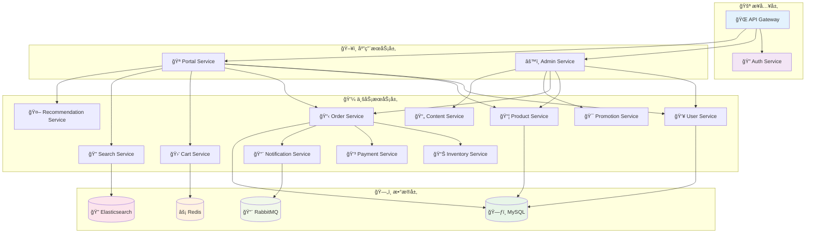
```mermaid
flowchart TB
    subgraph "🚪 æ¥å…¥å±‚"
        GW["🌠API Gateway"]
        AUTH["🔠Auth Service"]
    end
  
    subgraph "💼 业务æœåŠ¡å±‚"
        USER["👥 User Service"]
        PRODUCT["📦 Product Service"]
        ORDER["📋 Order Service"]
        CART["🛒 Cart Service"]
        INVENTORY["📊 Inventory Service"]
        PAYMENT["💳 Payment Service"]
        SEARCH["🔠Search Service"]
        PROMOTION["🯠Promotion Service"]
        CONTENT["📄 Content Service"]
        NOTIFICATION["📨 Notification Service"]
        RECOMMENDATION["🤖 Recommendation Service"]
    end
  
    subgraph "ğŸ–¥ï¸ åº”ç”¨æœåŠ¡å±‚"
        ADMIN["âš™ï¸ Admin Service"]
        PORTAL["🪠Portal Service"]
    end
  
    subgraph "ğŸ—„ï¸ æ•°æ®å±‚"
        MYSQL[("ğŸ—ƒï¸ MySQL")]
        REDIS[("âš¡ Redis")]
        ES[("🔠Elasticsearch")]
        MQ[("📨 RabbitMQ")]
    end
  
    GW --> AUTH
    GW --> ADMIN
    GW --> PORTAL
  
    ADMIN --> USER
    ADMIN --> PRODUCT
    ADMIN --> ORDER
    ADMIN --> PROMOTION
    ADMIN --> CONTENT
  
    PORTAL --> USER
    PORTAL --> PRODUCT
    PORTAL --> ORDER
    PORTAL --> CART
    PORTAL --> SEARCH
    PORTAL --> RECOMMENDATION
  
    ORDER --> INVENTORY
    ORDER --> PAYMENT
    ORDER --> NOTIFICATION
  
    USER --> MYSQL
    PRODUCT --> MYSQL
    ORDER --> MYSQL
    CART --> REDIS
    SEARCH --> ES
    NOTIFICATION --> MQ
  
    style GW fill:#e3f2fd
    style AUTH fill:#f3e5f5
    style MYSQL fill:#e8f5e8
    style REDIS fill:#fff3e0
    style ES fill:#fce4ec
    style MQ fill:#f1f8e9
```

### 📋 å¾®æœåŠ¡è¯¦ç»†è¯´æ˜

| å¾®æœåŠ¡å称                         | èŒè´£æè¿°                                         | å¯¹åº”åŸ Java æ¨¡å—            | 技术栈        |
| ---------------------------------- | ------------------------------------------------ | --------------------------- | ------------- |
| 🚪**gateway-service**        | API 网关，负责请求路由ã€è´Ÿè½½å‡è¡¡ã€é™æµç­‰         | æ–°å¢                        | Gin + Consul  |
| ğŸ”**auth-service**           | 认è¯æœåŠ¡ï¼Œç»Ÿä¸€è®¤è¯ä¸­å¿ƒ                           | æ–°å¢                        | JWT + Redis   |
| 👥**user-service**           | 用户æœåŠ¡ï¼Œè´Ÿè´£ç”¨æˆ·æ³¨å†Œã€ç™»å½•ã€è®¤è¯ç­‰ç”¨æˆ·ç›¸å…³æ“作 | mall-security, UMS ç›¸å…³æ¨¡å— | GORM + MySQL  |
| 📦**product-service**        | 商å“æœåŠ¡ï¼Œè´Ÿè´£å•†å“ CRUDã€åˆ†ç±»ã€å“牌管ç†ç­‰        | PMS ç›¸å…³æ¨¡å—                | GORM + MySQL  |
| 📋**order-service**          | 订å•æœåŠ¡ï¼Œè´Ÿè´£è®¢å•åˆ›å»ºã€æ”¯ä»˜ã€é€€æ¬¾ç­‰             | OMS ç›¸å…³æ¨¡å—                | GORM + MySQL  |
| 🛒**cart-service**           | 购物车æœåŠ¡ï¼Œè´Ÿè´£è´­ç‰©è½¦å•†å“ç®¡ç†                   | OMS è´­ç‰©è½¦ç›¸å…³æ¨¡å—          | Redis         |
| 📊**inventory-service**      | 库存æœåŠ¡ï¼Œè´Ÿè´£å•†å“åº“å­˜ç®¡ç†                       | PMS åº“å­˜ç›¸å…³æ¨¡å—            | GORM + Redis  |
| 💳**payment-service**        | 支付æœåŠ¡ï¼Œå¯¹æ¥å„ç§æ”¯ä»˜æ¸ é“                       | OMS æ”¯ä»˜ç›¸å…³æ¨¡å—            | 第三方支付SDK |
| ğŸ”**search-service**         | æœç´¢æœåŠ¡ï¼Œæ供商å“æœç´¢èƒ½åŠ›                       | mall-search                 | Elasticsearch |
| ğŸ¯**promotion-service**      | 促销æœåŠ¡ï¼Œç®¡ç†ä¼˜æƒ åˆ¸ã€æ»¡å‡ã€ç§’æ€ç­‰ä¿ƒé”€æ´»åŠ¨       | SMS ç›¸å…³æ¨¡å—                | GORM + Redis  |
| 📄**content-service**        | 内容æœåŠ¡ï¼Œç®¡ç†é¦–页内容ã€å¹¿å‘Šã€ä¸“题等             | CMS ç›¸å…³æ¨¡å—                | GORM + MySQL  |
| 📨**notification-service**   | 通知æœåŠ¡ï¼Œè´Ÿè´£é‚®ä»¶ã€çŸ­ä¿¡ç­‰æ¶ˆæ¯é€šçŸ¥               | æ–°å¢                        | RabbitMQ      |
| 🤖**recommendation-service** | æ¨èæœåŠ¡ï¼ŒåŸºäº AI 的商å“æ¨è                     | æ–°å¢                        | 机器学习算法  |
| âš™ï¸**admin-service**        | åå°ç®¡ç†æœåŠ¡ï¼Œæä¾›åå°ç®¡ç† API                   | mall-admin                  | Gin + gRPC    |
| ğŸª**portal-service**         | å‰å°é—¨æˆ·æœåŠ¡ï¼Œæä¾›å‰å°å•†åŸ API                   | mall-portal                 | Gin + gRPC    |

### 🌠微æœåŠ¡é€šä¿¡æ¶æ„

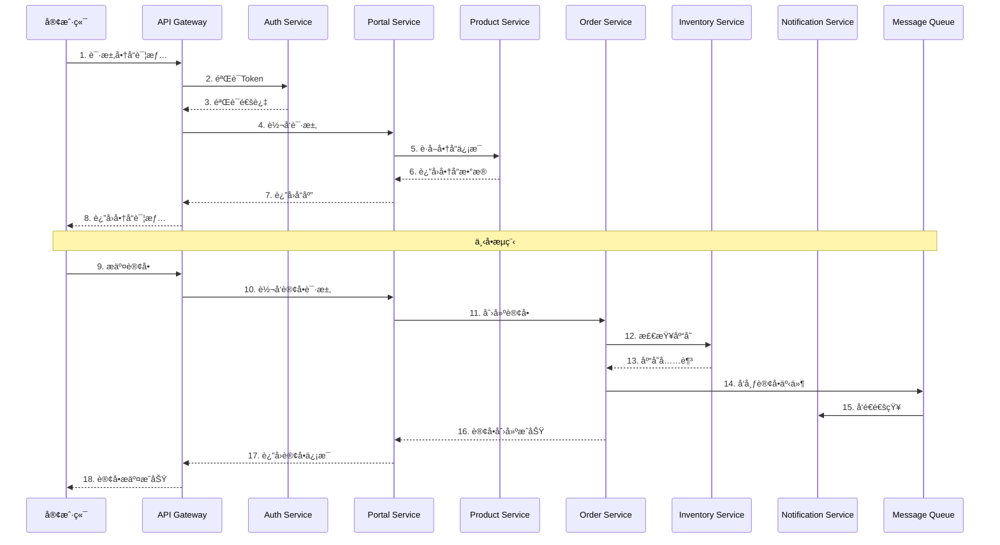
```mermaid
sequenceDiagram
    participant C as 客户端
    participant G as API Gateway
    participant A as Auth Service
    participant P as Portal Service
    participant PS as Product Service
    participant OS as Order Service
    participant IS as Inventory Service
    participant NS as Notification Service
    participant MQ as Message Queue
  
    C->>G: 1. 请求商å“详情
    G->>A: 2. 验è¯Token
    A-->>G: 3. 验è¯é€šè¿‡
    G->>P: 4. 转å‘请求
    P->>PS: 5. è·å–商å“ä¿¡æ¯
    PS-->>P: 6. è¿”å›å•†å“æ•°æ®
    P-->>G: 7. è¿”å›å“应
    G-->>C: 8. è¿”å›å•†å“详情
  
    Note over C,MQ: 下å•æµç¨‹
    C->>G: 9. æ交订å•
    G->>P: 10. 转å‘订å•è¯·æ±‚
    P->>OS: 11. 创建订å•
    OS->>IS: 12. 检查库存
    IS-->>OS: 13. 库存充足
    OS->>MQ: 14. å‘布订å•äº‹ä»¶
    MQ->>NS: 15. å‘é€é€šçŸ¥
    OS-->>P: 16. 订å•åˆ›å»ºæˆåŠŸ
    P-->>G: 17. è¿”å›è®¢å•ä¿¡æ¯
    G-->>C: 18. 订å•æ交æˆåŠŸ
```

### 🔄 å¾®æœåŠ¡é€šä¿¡æ–¹å¼

mall-go å¾®æœåŠ¡é‡‡ç”¨å¤šç§é€šä¿¡æ–¹å¼ï¼Œæ ¹æ®ä¸åŒåœºæ™¯é€‰æ‹©æœ€é€‚åˆçš„通信模å¼ï¼š

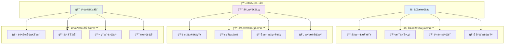
```mermaid
flowchart TD
    subgraph "🔄 通信方å¼"
        SYNC["âš¡ åŒæ­¥é€šä¿¡"]
        ASYNC["📨 异步通信"]
        EVENT["🯠事件驱动"]
    end
  
    subgraph "âš¡ åŒæ­¥é€šä¿¡åœºæ™¯"
        SYNC --> S1["🔠å®æ—¶æŸ¥è¯¢"]
        SYNC --> S2["💳 支付处ç†"]
        SYNC --> S3["🔠身份验è¯"]
        SYNC --> S4["📊 库存检查"]
    end
  
    subgraph "📨 异步通信场景"
        ASYNC --> A1["📧 邮件通知"]
        ASYNC --> A2["📱 短信å‘é€"]
        ASYNC --> A3["📊 æ•°æ®ç»Ÿè®¡"]
        ASYNC --> A4["🔄 æ•°æ®åŒæ­¥"]
    end
  
    subgraph "🯠事件驱动场景"
        EVENT --> E1["📋 订å•çŠ¶æ€å˜æ›´"]
        EVENT --> E2["📦 库存å˜åŠ¨"]
        EVENT --> E3["👤 用户行为"]
        EVENT --> E4["🯠è¥é”€è§¦å‘"]
    end
  
    style SYNC fill:#e3f2fd
    style ASYNC fill:#f3e5f5
    style EVENT fill:#e8f5e8
```

#### 1. âš¡ åŒæ­¥é€šä¿¡ (gRPC)

适用äºéœ€è¦å®æ—¶å“应的场景，如用户认è¯ã€å•†å“查询ã€æ”¯ä»˜å¤„ç†ç­‰ã€‚

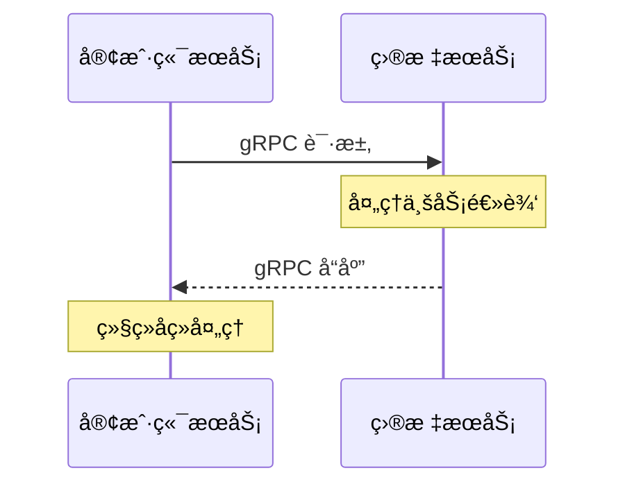
```mermaid
sequenceDiagram
    participant Client as 客户端æœåŠ¡
    participant Server as 目标æœåŠ¡
  
    Client->>Server: gRPC 请求
    Note over Server: 处ç†ä¸šåŠ¡é€»è¾‘
    Server-->>Client: gRPC å“应
    Note over Client: 继续å续处ç†
```

#### 2. 📨 异步通信 (Message Queue)

适用äºå¯ä»¥å¼‚步处ç†çš„场景，如通知å‘é€ã€æ•°æ®ç»Ÿè®¡ã€æ—¥å¿—记录等。

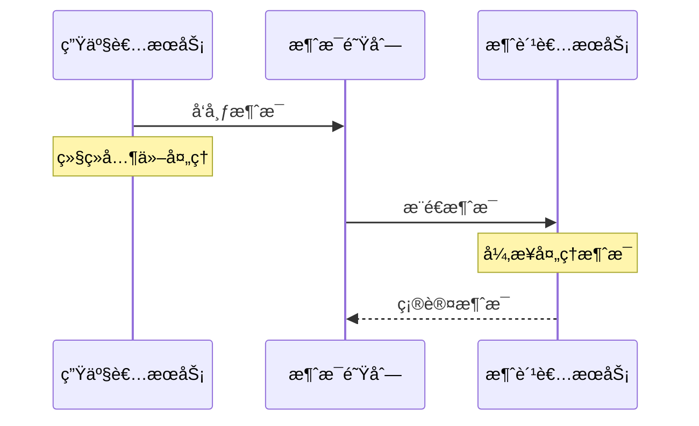
```mermaid
sequenceDiagram
    participant P as 生产者æœåŠ¡
    participant MQ as 消æ¯é˜Ÿåˆ—
    participant C as 消费者æœåŠ¡
  
    P->>MQ: å‘布消æ¯
    Note over P: 继续其他处ç†
    MQ->>C: æ¨é€æ¶ˆæ¯
    Note over C: 异步处ç†æ¶ˆæ¯
    C-->>MQ: 确认消æ¯
```

#### 3. 🯠事件驱动 (Event Sourcing)

适用äºéœ€è¦è®°å½•çŠ¶æ€å˜æ›´å†å²çš„场景，如订å•çŠ¶æ€å˜æ›´ã€åº“å­˜å˜åŠ¨ç­‰ã€‚

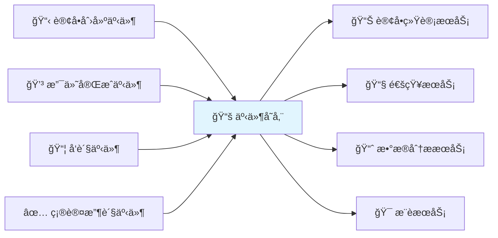
```mermaid
flowchart LR
    E1["📋 订å•åˆ›å»ºäº‹ä»¶"] --> ES["📚 事件存储"]
    E2["💳 支付完æˆäº‹ä»¶"] --> ES
    E3["📦 å‘货事件"] --> ES
    E4["✅ 确认收货事件"] --> ES
  
    ES --> H1["📊 订å•ç»Ÿè®¡æœåŠ¡"]
    ES --> H2["📧 通知æœåŠ¡"]
    ES --> H3["📈 æ•°æ®åˆ†ææœåŠ¡"]
    ES --> H4["🯠æ¨èæœåŠ¡"]
  
    style ES fill:#e1f5fe
```

## ğŸ—ï¸ é¢†åŸŸé©±åŠ¨è®¾è®¡(DDD)

mall-go 项目采用领域驱动设计(Domain-Driven Design, DDD)çš„æ€æƒ³è¿›è¡Œè®¾è®¡ï¼Œå°†ä¸šåŠ¡é€»è¾‘组织在领域模å‹ä¸­ï¼Œä½¿å¾—代ç ç»“æ„ä¸ä¸šåŠ¡é¢†åŸŸæ›´åŠ åŒ¹é…。

### 🯠DDD 分层æ¶æ„

æ¯ä¸ªå¾®æœåŠ¡å†…部采用 DDD 四层æ¶æ„，确ä¿ä¸šåŠ¡é€»è¾‘ä¸æŠ€æœ¯å®ç°çš„清晰分离：

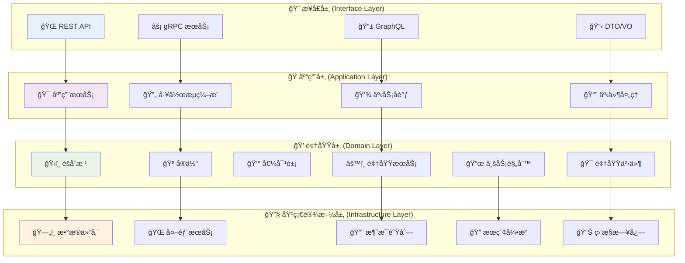
```mermaid
flowchart TD
    subgraph "🨠æ¥å£å±‚ (Interface Layer)"
        I1["🌠REST API"]
        I2["âš¡ gRPC æœåŠ¡"]
        I3["📱 GraphQL"]
        I4["📋 DTO/VO"]
    end
  
    subgraph "🭠应用层 (Application Layer)"
        A1["🯠应用æœåŠ¡"]
        A2["🔄 工作æµç¼–æ’"]
        A3["💾 事务åè°ƒ"]
        A4["📨 事件处ç†"]
    end
  
    subgraph "💠领域层 (Domain Layer)"
        D1["ğŸ›ï¸ èšåˆæ ¹"]
        D2["🪠å®ä½“"]
        D3["💰 值对象"]
        D4["âš™ï¸ é¢†åŸŸæœåŠ¡"]
        D5["📜 业务规则"]
        D6["🯠领域事件"]
    end
  
    subgraph "🔧 基础设施层 (Infrastructure Layer)"
        IF1["ğŸ—„ï¸ æ•°æ®ä»“储"]
        IF2["🌠外部æœåŠ¡"]
        IF3["📨 消æ¯é˜Ÿåˆ—"]
        IF4["🔠æœç´¢å¼•æ“"]
        IF5["📊 监æ§æ—¥å¿—"]
    end
  
    I1 --> A1
    I2 --> A2
    I3 --> A3
    I4 --> A4
  
    A1 --> D1
    A2 --> D2
    A3 --> D4
    A4 --> D6
  
    D1 --> IF1
    D2 --> IF2
    D4 --> IF3
    D5 --> IF4
    D6 --> IF5
  
    style I1 fill:#e3f2fd
    style A1 fill:#f3e5f5
    style D1 fill:#e8f5e8
    style IF1 fill:#fff3e0
```

### ğŸ›ï¸ 核心领域模å‹

```mermaid
classDiagram
    class User {
        +UserID: string
        +Username: string
        +Email: Email
        +Phone: Phone
        +Status: UserStatus
        +CreatedAt: time.Time
        +Register()
        +Login()
        +UpdateProfile()
        +ChangePassword()
    }
  
    class Product {
        +ProductID: string
        +Name: string
        +Price: Money
        +Stock: int
        +CategoryID: string
        +Status: ProductStatus
        +UpdatePrice(Money)
        +UpdateStock(int)
        +Publish()
        +Unpublish()
    }
  
    class Order {
        +OrderID: string
        +UserID: string
        +Items: []OrderItem
        +TotalAmount: Money
        +Status: OrderStatus
        +CreatedAt: time.Time
        +AddItem(OrderItem)
        +RemoveItem(string)
        +CalculateTotal()
        +Submit()
        +Cancel()
        +Pay()
    }
  
    class OrderItem {
        +ProductID: string
        +ProductName: string
        +Quantity: int
        +Price: Money
        +Amount: Money
        +Calculate()
    }
  
    class Payment {
        +PaymentID: string
        +OrderID: string
        +Amount: Money
        +Method: PaymentMethod
        +Status: PaymentStatus
        +CreatedAt: time.Time
        +Process()
        +Refund()
        +Confirm()
    }
  
    class Category {
        +CategoryID: string
        +Name: string
        +ParentID: string
        +Level: int
        +Sort: int
        +Status: CategoryStatus
    }
  
    User ||--o{ Order : "下å•"
    Order ||--o{ OrderItem : "包å«"
    Product ||--o{ OrderItem : "商å“"
    Order ||--|| Payment : "支付"
    Category ||--o{ Product : "分类"
```

#### 🨠æ¥å£å±‚ (Interface Layer)

负责处ç†å¤–部请求和å“应，æ供多ç§æ¥å£å½¢å¼ï¼š

- **🌠REST API**: 标准的 HTTP RESTful æ¥å£ï¼Œé€‚ç”¨äº Web 和移动端
- **âš¡ gRPC æœåŠ¡**: 高性能的 RPC 调用，适用äºå¾®æœåŠ¡é—´é€šä¿¡
- **📱 GraphQL**: çµæ´»çš„查询æ¥å£ï¼Œé€‚用äºå¤æ‚æ•°æ®æŸ¥è¯¢
- **📋 DTO/VO**: æ•°æ®ä¼ è¾“对象和视图对象定义

#### 🭠应用层 (Application Layer)

å调领域对象完æˆå¤æ‚的业务用例，ä¸åŒ…å«ä¸šåŠ¡è§„则：

- **🯠应用æœåŠ¡**: å®ç°å…·ä½“的业务用例
- **🔄 工作æµç¼–æ’**: å调多个领域æœåŠ¡å®Œæˆå¤æ‚æµç¨‹
- **💾 事务åè°ƒ**: ä¿è¯æ•°æ®ä¸€è‡´æ€§å’Œå®Œæ•´æ€§
- **📨 事件处ç†**: 处ç†é¢†åŸŸäº‹ä»¶å’Œé›†æˆäº‹ä»¶

#### 💠领域层 (Domain Layer)

系统的核心，包å«æ‰€æœ‰ä¸šåŠ¡é€»è¾‘和规则：

- **ğŸ›ï¸ èšåˆæ ¹**: 定义数æ®ä¸€è‡´æ€§è¾¹ç•Œï¼Œå¦‚ Orderã€User
- **🪠å®ä½“**: 具有唯一标识的业务对象
- **💰 值对象**: ä¸å¯å˜çš„值类å‹ï¼Œå¦‚ Moneyã€Email
- **âš™ï¸ é¢†åŸŸæœåŠ¡**: è·¨å®ä½“的业务逻辑
- **📜 业务规则**: 核心业务约æŸå’Œè§„则
- **🯠领域事件**: 业务状æ€å˜æ›´äº‹ä»¶

#### 🔧 基础设施层 (Infrastructure Layer)

æ供技术å®ç°å’Œå¤–部系统集æˆï¼š

- **ğŸ—„ï¸ æ•°æ®ä»“储**: æ•°æ®æŒä¹…化和查询å®ç°
- **🌠外部æœåŠ¡**: 第三方 API 集æˆ
- **📨 消æ¯é˜Ÿåˆ—**: 异步消æ¯å¤„ç†
- **🔠æœç´¢å¼•æ“**: 全文æœç´¢åŠŸèƒ½
- **📊 监æ§æ—¥å¿—**: 系统监æ§å’Œæ—¥å¿—记录

### 领域模å‹ç¤ºä¾‹

以商å“æœåŠ¡ä¸ºä¾‹ï¼Œå±•ç¤º DDD 的领域模å‹ç»“æ„：

```go
// domain/model/product.go - 商å“领域模å‹
package model

import (
    "errors"
    "time"
)

// Product 商å“èšåˆæ ¹
type Product struct {
    ID                  string
    Name                string
    Description         string
    Price               Money
    Status              ProductStatus
    Inventory           Inventory
    Brand               Brand
    Category            Category
    Attributes          []Attribute
    Promotion           *Promotion
    CreatedAt           time.Time
    UpdatedAt           time.Time
}

// 值对象
type Money struct {
    Amount   float64
    Currency string
}

// 值对象
type Inventory struct {
    AvailableQuantity int
    ReservedQuantity  int
    LowStockThreshold int
}

// 值对象
type Attribute struct {
    Name  string
    Value string
}

// å®ä½“
type Brand struct {
    ID   string
    Name string
    Logo string
}

// å®ä½“
type Category struct {
    ID       string
    Name     string
    ParentID string
    Level    int
}

// å®ä½“
type Promotion struct {
    ID           string
    Type         PromotionType
    Discount     float64
    StartTime    time.Time
    EndTime      time.Time
    Requirements map[string]interface{}
}

// æšä¸¾
type ProductStatus string
const (
    ProductStatusDraft     ProductStatus = "draft"
    ProductStatusActive    ProductStatus = "active"
    ProductStatusInactive  ProductStatus = "inactive"
    ProductStatusDeleted   ProductStatus = "deleted"
)

type PromotionType string
const (
    PromotionTypePercentage PromotionType = "percentage"
    PromotionTypeFixedAmount PromotionType = "fixed_amount"
    PromotionTypeBundle     PromotionType = "bundle"
)

// 领域行为/业务规则
func (p *Product) Publish() error {
    if p.Name == "" || p.Price.Amount <= 0 {
        return errors.New("product must have a name and a valid price to be published")
    }

    if p.Inventory.AvailableQuantity <= 0 {
        return errors.New("cannot publish product with zero inventory")
    }

    p.Status = ProductStatusActive
    p.UpdatedAt = time.Now()
    return nil
}

func (p *Product) UpdateInventory(quantity int) error {
    if quantity < 0 && p.Inventory.AvailableQuantity + quantity < 0 {
        return errors.New("insufficient inventory")
    }

    p.Inventory.AvailableQuantity += quantity
    p.UpdatedAt = time.Now()
    return nil
}

func (p *Product) ApplyPromotion(promotion *Promotion) error {
    if promotion.EndTime.Before(time.Now()) {
        return errors.New("cannot apply expired promotion")
    }

    p.Promotion = promotion
    p.UpdatedAt = time.Now()
    return nil
}
```

### 仓储æ¥å£

DDD 中，领域模å‹é€šè¿‡ä»“储(Repository)ä¸æŒä¹…化层交互：

```go
// domain/repository/product_repository.go - 商å“仓储æ¥å£
package repository

import (
    "context"

    "mall-go/product-service/domain/model"
)

// ProductRepository 定义了商å“èšåˆæ ¹çš„仓储æ¥å£
type ProductRepository interface {
    Save(ctx context.Context, product *model.Product) error
    FindByID(ctx context.Context, id string) (*model.Product, error)
    FindByCategory(ctx context.Context, categoryID string, page, size int) ([]*model.Product, int64, error)
    FindByBrand(ctx context.Context, brandID string, page, size int) ([]*model.Product, int64, error)
    Search(ctx context.Context, query string, filters map[string]interface{}, page, size int) ([]*model.Product, int64, error)
    Update(ctx context.Context, product *model.Product) error
    Delete(ctx context.Context, id string) error
}
```

### 应用æœåŠ¡

DDD 中，应用æœåŠ¡å调领域对象，完æˆç‰¹å®šçš„用例：

```go
// application/service/product_service.go - 商å“应用æœåŠ¡
package service

import (
    "context"

    "mall-go/product-service/application/dto"
    "mall-go/product-service/domain/model"
    "mall-go/product-service/domain/repository"
)

type ProductService struct {
    productRepo repository.ProductRepository
    brandRepo   repository.BrandRepository
    categoryRepo repository.CategoryRepository
    eventBus     event.Bus
}

func NewProductService(
    productRepo repository.ProductRepository,
    brandRepo repository.BrandRepository,
    categoryRepo repository.CategoryRepository,
    eventBus event.Bus,
) *ProductService {
    return &ProductService{
        productRepo: productRepo,
        brandRepo:   brandRepo,
        categoryRepo: categoryRepo,
        eventBus:     eventBus,
    }
}

// CreateProduct 创建新商å“
func (s *ProductService) CreateProduct(ctx context.Context, req dto.CreateProductRequest) (*dto.ProductResponse, error) {
    // è·å–å“牌信æ¯
    brand, err := s.brandRepo.FindByID(ctx, req.BrandID)
    if err != nil {
        return nil, err
    }

    // è·å–分类信æ¯
    category, err := s.categoryRepo.FindByID(ctx, req.CategoryID)
    if err != nil {
        return nil, err
    }

    // 创建商å“领域模å‹
    product := &model.Product{
        ID:          uuid.New().String(),
        Name:        req.Name,
        Description: req.Description,
        Price: model.Money{
            Amount:   req.Price,
            Currency: "CNY",
        },
        Status: model.ProductStatusDraft,
        Inventory: model.Inventory{
            AvailableQuantity: req.StockQuantity,
            ReservedQuantity:  0,
            LowStockThreshold: req.LowStockThreshold,
        },
        Brand:       *brand,
        Category:    *category,
        Attributes:  req.Attributes,
        CreatedAt:   time.Now(),
        UpdatedAt:   time.Now(),
    }

    // ä¿å­˜å•†å“
    if err := s.productRepo.Save(ctx, product); err != nil {
        return nil, err
    }

    // å‘布事件
    s.eventBus.Publish("product.created", map[string]interface{}{
        "productId": product.ID,
        "name":      product.Name,
        "price":     product.Price.Amount,
    })

    // 转æ¢ä¸ºDTO
    return &dto.ProductResponse{
        ID:          product.ID,
        Name:        product.Name,
        Description: product.Description,
        Price:       product.Price.Amount,
        Status:      string(product.Status),
        StockQuantity: product.Inventory.AvailableQuantity,
        BrandID:     product.Brand.ID,
        BrandName:   product.Brand.Name,
        CategoryID:  product.Category.ID,
        CategoryName: product.Category.Name,
        Attributes:  product.Attributes,
        CreatedAt:   product.CreatedAt,
    }, nil
}

// 其他应用æœåŠ¡æ–¹æ³•...
```

## âš™ï¸ é…置中心ä¸æ³¨å†Œä¸­å¿ƒ

mall-go 项目引入é…置中心和注册中心，å®ç°é…置的集中管ç†ã€åŠ¨æ€æ›´æ–°ä»¥åŠæœåŠ¡çš„自动注册ä¸å‘ç°ã€‚

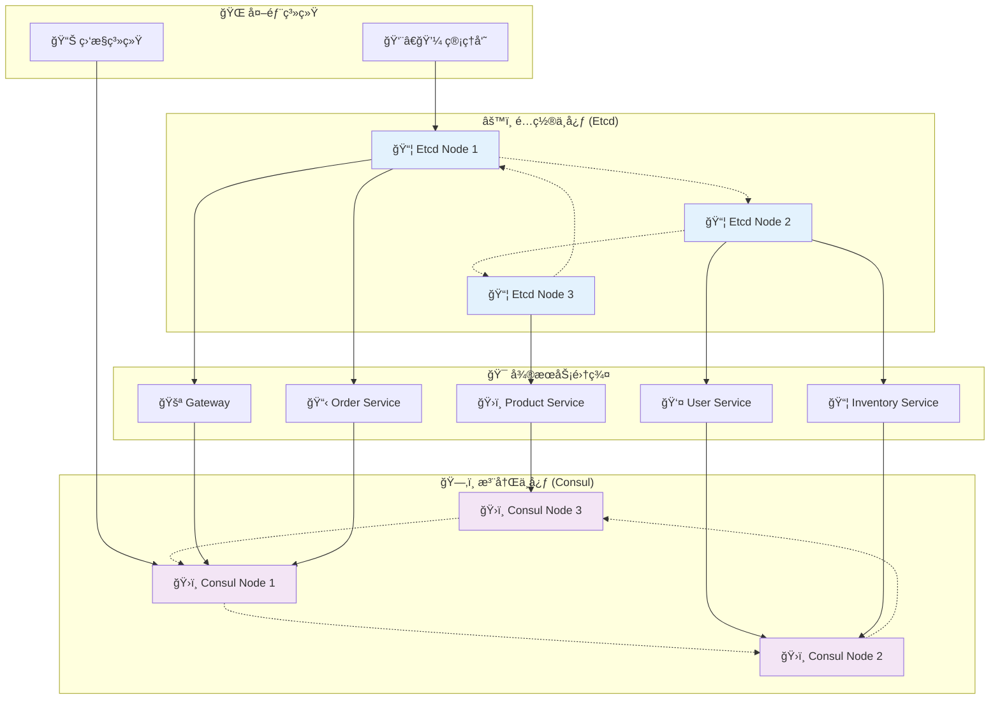
```mermaid
flowchart TD
    subgraph "🌠外部系统"
        Admin["👨â€ğŸ’¼ 管ç†å‘˜"]
        Monitor["📊 监æ§ç³»ç»Ÿ"]
    end
  
    subgraph "âš™ï¸ é…置中心 (Etcd)"
        E1["📦 Etcd Node 1"]
        E2["📦 Etcd Node 2"]
        E3["📦 Etcd Node 3"]
    end
  
    subgraph "ğŸ—‚ï¸ æ³¨å†Œä¸­å¿ƒ (Consul)"
        C1["ğŸ›ï¸ Consul Node 1"]
        C2["ğŸ›ï¸ Consul Node 2"]
        C3["ğŸ›ï¸ Consul Node 3"]
    end
  
    subgraph "🯠微æœåŠ¡é›†ç¾¤"
        GW["🚪 Gateway"]
        US["👤 User Service"]
        PS["ğŸ›ï¸ Product Service"]
        OS["📋 Order Service"]
        IS["📦 Inventory Service"]
    end
  
    Admin --> E1
    Monitor --> C1
  
    E1 -.-> E2
    E2 -.-> E3
    E3 -.-> E1
  
    C1 -.-> C2
    C2 -.-> C3
    C3 -.-> C1
  
    E1 --> GW
    E2 --> US
    E3 --> PS
    E1 --> OS
    E2 --> IS
  
    GW --> C1
    US --> C2
    PS --> C3
    OS --> C1
    IS --> C2
  
    style E1 fill:#e3f2fd
    style E2 fill:#e3f2fd
    style E3 fill:#e3f2fd
    style C1 fill:#f3e5f5
    style C2 fill:#f3e5f5
    style C3 fill:#f3e5f5
```

### ğŸ—„ï¸ é…置中心 (Etcd)

mall-go 项目采用 Etcd 作为分布å¼é…置中心，æ供统一的é…置管ç†èƒ½åŠ›ï¼š

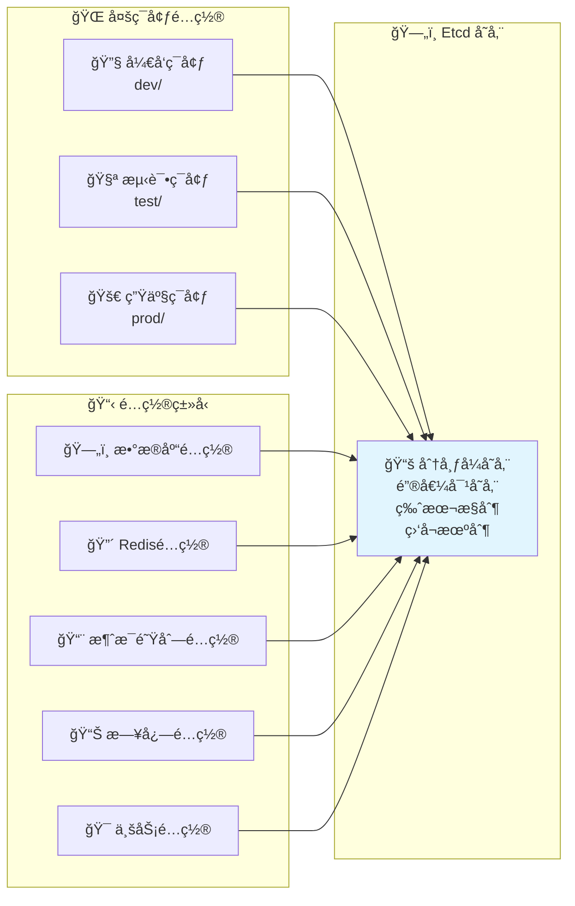
```mermaid
flowchart LR
    subgraph "🌠多ç¯å¢ƒé…ç½®"
        DEV["🔧 å¼€å‘ç¯å¢ƒ<br/>dev/"]
        TEST["🧪 测试ç¯å¢ƒ<br/>test/"]
        PROD["🚀 生产ç¯å¢ƒ<br/>prod/"]
    end
  
    subgraph "📋 é…置类å‹"
        DB["ğŸ—„ï¸ æ•°æ®åº“é…ç½®"]
        REDIS["🔴 Redisé…ç½®"]
        MQ["📨 消æ¯é˜Ÿåˆ—é…ç½®"]
        LOG["📊 日志é…ç½®"]
        BIZ["🯠业务é…ç½®"]
    end
  
    subgraph "ğŸ—„ï¸ Etcd 存储"
        ETCD["📚 分布å¼å­˜å‚¨<br/>键值对存储<br/>版本æ§åˆ¶<br/>监å¬æœºåˆ¶"]
    end
  
    DEV --> ETCD
    TEST --> ETCD
    PROD --> ETCD
  
    DB --> ETCD
    REDIS --> ETCD
    MQ --> ETCD
    LOG --> ETCD
    BIZ --> ETCD
  
    style ETCD fill:#e1f5fe
```

#### 🯠核心功能

1. **📋 é…置集中管ç†**: 所有æœåŠ¡çš„é…置统一存储在é…置中心，é¿å…é…置分散
2. **🔄 é…置动æ€æ›´æ–°**: 支æŒé…置热更新，无需é‡å¯æœåŠ¡
3. **🌠ç¯å¢ƒéš”离**: 支æŒå¼€å‘ã€æµ‹è¯•ã€ç”Ÿäº§ç­‰å¤šç¯å¢ƒé…置管ç†
4. **📚 é…置版本æ§åˆ¶**: 记录é…ç½®å˜æ›´å†å²ï¼Œæ”¯æŒç‰ˆæœ¬å›æ»š
5. **🔠安全æ§åˆ¶**: 支æŒé…置加密和访问æƒé™æ§åˆ¶
6. **📊 监æ§å‘Šè­¦**: é…ç½®å˜æ›´ç›‘æ§å’Œå¼‚常告警

> **💡 æ示**: 所有的é…置文件都存放在 `configs/` 目录下，方便集中管ç†å’Œç»´æŠ¤ã€‚

#### 🔄 é…置更新æµç¨‹

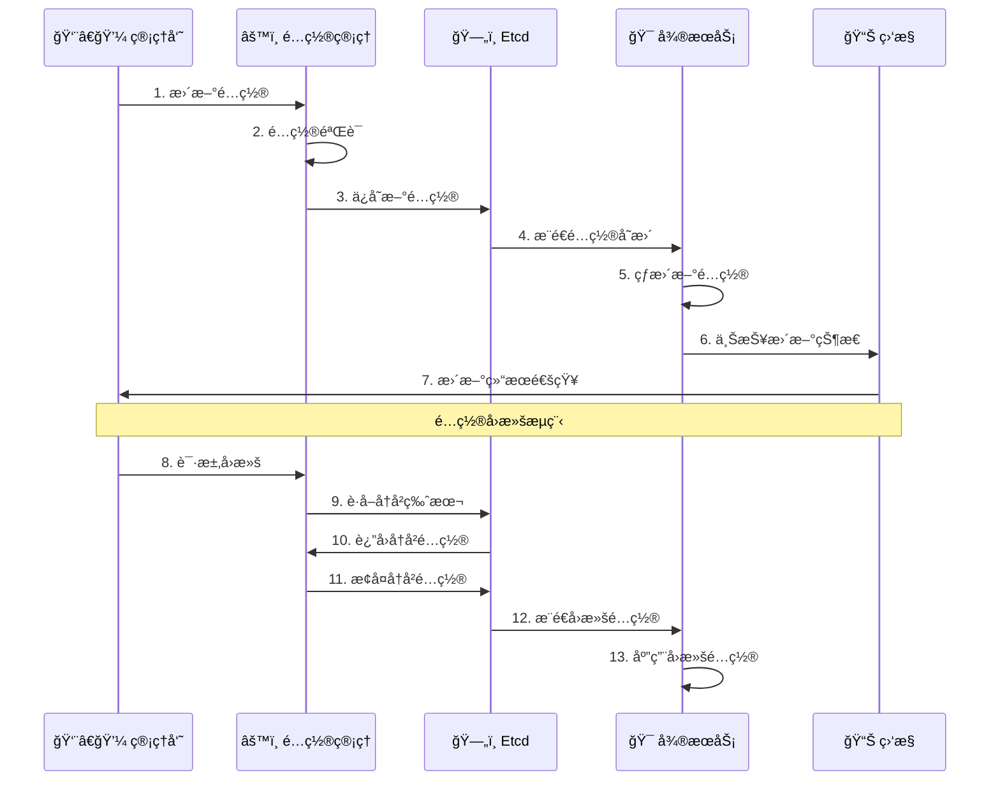
```mermaid
sequenceDiagram
    participant Admin as 👨â€ğŸ’¼ 管ç†å‘˜
    participant CM as âš™ï¸ é…置管ç†
    participant Etcd as ğŸ—„ï¸ Etcd
    participant Service as 🯠微æœåŠ¡
    participant Monitor as 📊 监æ§
  
    Admin->>CM: 1. æ›´æ–°é…ç½®
    CM->>CM: 2. é…置验è¯
    CM->>Etcd: 3. ä¿å­˜æ–°é…ç½®
    Etcd->>Service: 4. æ¨é€é…ç½®å˜æ›´
    Service->>Service: 5. 热更新é…ç½®
    Service->>Monitor: 6. 上报更新状æ€
    Monitor->>Admin: 7. 更新结æœé€šçŸ¥
  
    Note over Admin,Monitor: é…ç½®å›æ»šæµç¨‹
    Admin->>CM: 8. 请求å›æ»š
    CM->>Etcd: 9. è·å–å†å²ç‰ˆæœ¬
    Etcd->>CM: 10. è¿”å›å†å²é…ç½®
    CM->>Etcd: 11. æ¢å¤å†å²é…ç½®
    Etcd->>Service: 12. æ¨é€å›æ»šé…ç½®
    Service->>Service: 13. 应用å›æ»šé…ç½®
```

#### Etcd é…置中心å®ç°ï¼š

```go
// pkg/config/etcd.go - Etcdé…置中心客户端
package config

import (
    "context"
    "encoding/json"
    "fmt"
    "log"
    "time"

    clientv3 "go.etcd.io/etcd/client/v3"
)

// EtcdClient Etcd客户端
type EtcdClient struct {
    client *clientv3.Client
    prefix string
}

// NewEtcdClient 创建Etcd客户端
func NewEtcdClient(endpoints []string, prefix string) (*EtcdClient, error) {
    cli, err := clientv3.New(clientv3.Config{
        Endpoints:   endpoints,
        DialTimeout: 5 * time.Second,
    })
    if err != nil {
        log.Printf("åˆå§‹åŒ–Etcd客户端失败: %v", err)
        return nil, err
    }

    return &EtcdClient{
        client: cli,
        prefix: prefix,
    }, nil
}

// Close 关闭Etcd客户端
func (c *EtcdClient) Close() error {
    return c.client.Close()
}

// LoadConfig ä»é…置中心加载é…ç½®
func (c *EtcdClient) LoadConfig(key string, configStruct interface{}) error {
    ctx, cancel := context.WithTimeout(context.Background(), 5*time.Second)
    defer cancel()

    fullKey := fmt.Sprintf("%s/%s", c.prefix, key)
    resp, err := c.client.Get(ctx, fullKey)
    if err != nil {
        log.Printf("ä»Etcdè·å–é…置失败: %v", err)
        return err
    }

    if len(resp.Kvs) == 0 {
        return fmt.Errorf("é…ç½®ä¸å­˜åœ¨: %s", fullKey)
    }

    value := resp.Kvs[0].Value
    err = json.Unmarshal(value, configStruct)
    if err != nil {
        log.Printf("解æé…置失败: %v", err)
        return err
    }

    return nil
}

// SaveConfig ä¿å­˜é…置到é…置中心
func (c *EtcdClient) SaveConfig(key string, configStruct interface{}) error {
    ctx, cancel := context.WithTimeout(context.Background(), 5*time.Second)
    defer cancel()

    value, err := json.Marshal(configStruct)
    if err != nil {
        log.Printf("åºåˆ—化é…置失败: %v", err)
        return err
    }

    fullKey := fmt.Sprintf("%s/%s", c.prefix, key)
    _, err = c.client.Put(ctx, fullKey, string(value))
    if err != nil {
        log.Printf("ä¿å­˜é…置到Etcd失败: %v", err)
        return err
    }

    return nil
}

// WatchConfig 监å¬é…ç½®å˜æ›´
func (c *EtcdClient) WatchConfig(key string, onChange func([]byte)) {
    fullKey := fmt.Sprintf("%s/%s", c.prefix, key)
    watchChan := c.client.Watch(context.Background(), fullKey)

    // 在新的goroutine中处ç†ç›‘å¬äº‹ä»¶
    go func() {
        for watchResp := range watchChan {
            for _, event := range watchResp.Events {
                if event.Type == clientv3.EventTypePut {
                    log.Printf("é…ç½®å‘生å˜æ›´: %s", fullKey)
                    onChange(event.Kv.Value)
                }
            }
        }
    }()
}
```

#### 使用示例：

```go
// æœåŠ¡å¯åŠ¨æ—¶åŠ è½½é…ç½®
type DatabaseConfig struct {
    Host     string `json:"host"`
    Port     int    `json:"port"`
    Username string `json:"username"`
    Password string `json:"password"`
    Database string `json:"database"`
}

var dbConfig DatabaseConfig

func init() {
    // åˆå§‹åŒ–Etcd客户端
    etcdClient, err := config.NewEtcdClient([]string{"etcd:2379"}, "mall-go")
    if err != nil {
        log.Fatalf("åˆå§‹åŒ–Etcd客户端失败: %v", err)
    }
    defer etcdClient.Close()

    // 加载数æ®åº“é…ç½®
    if err := etcdClient.LoadConfig("database-config", &dbConfig); err != nil {
        log.Fatalf("加载数æ®åº“é…置失败: %v", err)
    }

    // 监å¬é…ç½®å˜æ›´
    etcdClient.WatchConfig("database-config", func(data []byte) {
        var newConfig DatabaseConfig
        if err := json.Unmarshal(data, &newConfig); err != nil {
            log.Printf("解æé…置失败: %v", err)
            return
        }

        log.Printf("æ•°æ®åº“é…置已更新: %+v", newConfig)
        dbConfig = newConfig
        // æ›´æ–°æ•°æ®åº“è¿æ¥æ± 
        updateDBConnection()
    })
}

// ä¿å­˜é…置示例
func saveConfigExample() {
    etcdClient, err := config.NewEtcdClient([]string{"etcd:2379"}, "mall-go")
    if err != nil {
        log.Fatalf("åˆå§‹åŒ–Etcd客户端失败: %v", err)
    }
    defer etcdClient.Close()

    // 创建é…ç½®
    dbConfig := DatabaseConfig{
        Host:     "mysql",
        Port:     3306,
        Username: "mall_user",
        Password: "mall_password",
        Database: "mall",
    }

    // ä¿å­˜é…ç½®
    if err := etcdClient.SaveConfig("database-config", dbConfig); err != nil {
        log.Fatalf("ä¿å­˜æ•°æ®åº“é…置失败: %v", err)
    }

    log.Println("é…置已ä¿å­˜åˆ°Etcd")
}
```

### ğŸ—‚ï¸ æ³¨å†Œä¸­å¿ƒ (Consul)

mall-go 项目采用 Consul 作为æœåŠ¡æ³¨å†Œä¸å‘ç°ä¸­å¿ƒï¼Œæ供高å¯ç”¨çš„æœåŠ¡æ²»ç†èƒ½åŠ›ï¼š

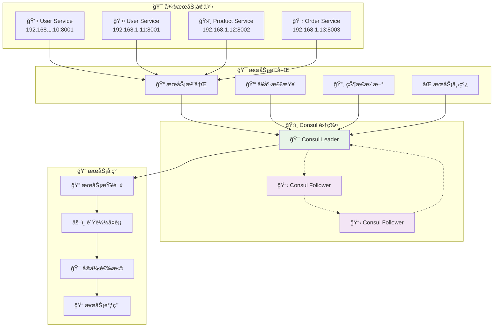
```mermaid
flowchart TD
    subgraph "ğŸ›ï¸ Consul 集群"
        C1["🯠Consul Leader"]
        C2["📋 Consul Follower"]
        C3["📋 Consul Follower"]
    end
  
    subgraph "🯠æœåŠ¡æ³¨å†Œ"
        REG1["📠æœåŠ¡æ³¨å†Œ"]
        REG2["💓 å¥åº·æ£€æŸ¥"]
        REG3["🔄 状æ€æ›´æ–°"]
        REG4["⌠æœåŠ¡ä¸‹çº¿"]
    end
  
    subgraph "🔠æœåŠ¡å‘ç°"
        DIS1["🔠æœåŠ¡æŸ¥è¯¢"]
        DIS2["âš–ï¸ è´Ÿè½½å‡è¡¡"]
        DIS3["🯠å®ä¾‹é€‰æ‹©"]
        DIS4["📠æœåŠ¡è°ƒç”¨"]
    end
  
    subgraph "🯠微æœåŠ¡å®ä¾‹"
        S1["👤 User Service<br/>192.168.1.10:8001"]
        S2["👤 User Service<br/>192.168.1.11:8001"]
        S3["ğŸ›ï¸ Product Service<br/>192.168.1.12:8002"]
        S4["📋 Order Service<br/>192.168.1.13:8003"]
    end
  
    C1 -.-> C2
    C2 -.-> C3
    C3 -.-> C1
  
    S1 --> REG1
    S2 --> REG1
    S3 --> REG1
    S4 --> REG1
  
    REG1 --> C1
    REG2 --> C1
    REG3 --> C1
    REG4 --> C1
  
    C1 --> DIS1
    DIS1 --> DIS2
    DIS2 --> DIS3
    DIS3 --> DIS4
  
    style C1 fill:#e8f5e8
    style C2 fill:#f3e5f5
    style C3 fill:#f3e5f5
```

#### 🯠核心功能

1. **📠æœåŠ¡æ³¨å†Œ**: æœåŠ¡å¯åŠ¨æ—¶è‡ªåŠ¨æ³¨å†Œåˆ°æ³¨å†Œä¸­å¿ƒ
2. **🔠æœåŠ¡å‘ç°**: 客户端通过注册中心å‘ç°æœåŠ¡å®ä¾‹
3. **💓 å¥åº·æ£€æŸ¥**: 定期检查æœåŠ¡å®ä¾‹çš„å¥åº·çŠ¶æ€
4. **âš–ï¸ è´Ÿè½½å‡è¡¡**: 支æŒå¤šç§è´Ÿè½½å‡è¡¡ç­–ç•¥
5. **🔄 故障转移**: 自动剔除ä¸å¥åº·çš„æœåŠ¡å®ä¾‹
6. **📊 æœåŠ¡ç›‘æ§**: æä¾›æœåŠ¡çŠ¶æ€å’Œæ€§èƒ½ç›‘æ§

#### 🔄 æœåŠ¡æ³¨å†Œä¸å‘ç°æµç¨‹

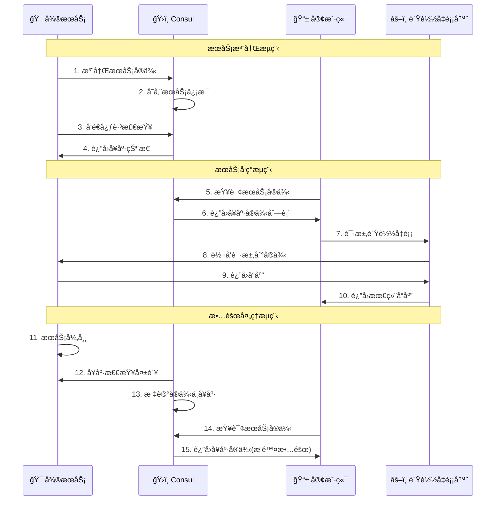
```mermaid
sequenceDiagram
    participant Service as 🯠微æœåŠ¡
    participant Consul as ğŸ›ï¸ Consul
    participant Client as 📱 客户端
    participant LB as âš–ï¸ è´Ÿè½½å‡è¡¡å™¨
  
    Note over Service,LB: æœåŠ¡æ³¨å†Œæµç¨‹
    Service->>Consul: 1. 注册æœåŠ¡å®ä¾‹
    Consul->>Consul: 2. 存储æœåŠ¡ä¿¡æ¯
    Service->>Consul: 3. å‘é€å¿ƒè·³æ£€æŸ¥
    Consul->>Service: 4. è¿”å›å¥åº·çŠ¶æ€
  
    Note over Service,LB: æœåŠ¡å‘ç°æµç¨‹
    Client->>Consul: 5. 查询æœåŠ¡å®ä¾‹
    Consul->>Client: 6. è¿”å›å¥åº·å®ä¾‹åˆ—表
    Client->>LB: 7. 请求负载å‡è¡¡
    LB->>Service: 8. 转å‘请求到å®ä¾‹
    Service->>LB: 9. è¿”å›å“应
    LB->>Client: 10. è¿”å›æœ€ç»ˆå“应
  
    Note over Service,LB: 故障处ç†æµç¨‹
    Service->>Service: 11. æœåŠ¡å¼‚常
    Consul->>Service: 12. å¥åº·æ£€æŸ¥å¤±è´¥
    Consul->>Consul: 13. 标记å®ä¾‹ä¸å¥åº·
    Client->>Consul: 14. 查询æœåŠ¡å®ä¾‹
    Consul->>Client: 15. è¿”å›å¥åº·å®ä¾‹(æ’除故障)
```

#### 🯠负载å‡è¡¡ç­–ç•¥

```mermaid
flowchart LR
    subgraph "âš–ï¸ è´Ÿè½½å‡è¡¡ç­–ç•¥"
        RR["🔄 轮询 (Round Robin)"]
        WRR["âš–ï¸ åŠ æƒè½®è¯¢"]
        LC["📊 最少è¿æ¥"]
        RAND["🲠éšæœº"]
        HASH["🔑 哈希"]
    end
  
    subgraph "🯠æœåŠ¡å®ä¾‹"
        I1["å®ä¾‹1<br/>æƒé‡:3"]
        I2["å®ä¾‹2<br/>æƒé‡:2"]
        I3["å®ä¾‹3<br/>æƒé‡:1"]
    end
  
    RR --> I1
    RR --> I2
    RR --> I3
  
    WRR --> I1
    WRR --> I2
    WRR --> I3
  
    LC --> I1
    LC --> I2
    LC --> I3
  
    RAND --> I1
    RAND --> I2
    RAND --> I3
  
    HASH --> I1
    HASH --> I2
    HASH --> I3
  
    style I1 fill:#e8f5e8
    style I2 fill:#fff3e0
    style I3 fill:#fce4ec
```

#### Consul 注册中心å®ç°ï¼š

```go
// pkg/registry/consul.go - ConsulæœåŠ¡æ³¨å†Œä¸å‘ç°
package registry

import (
    "fmt"
    "log"

    "github.com/hashicorp/consul/api"
)

// ServiceRegistry æœåŠ¡æ³¨å†Œæ¥å£
type ServiceRegistry interface {
    Register(serviceName, serviceID, serviceAddr string, servicePort int, tags []string) error
    Deregister(serviceID string) error
    GetService(serviceName string) ([]*api.AgentService, error)
}

// ConsulRegistry ConsulæœåŠ¡æ³¨å†Œå®ç°
type ConsulRegistry struct {
    client *api.Client
}

// NewConsulRegistry 创建Consul注册中心客户端
func NewConsulRegistry(addr string) (*ConsulRegistry, error) {
    config := api.DefaultConfig()
    config.Address = addr

    client, err := api.NewClient(config)
    if err != nil {
        return nil, err
    }

    return &ConsulRegistry{
        client: client,
    }, nil
}

// Register 注册æœåŠ¡
func (r *ConsulRegistry) Register(serviceName, serviceID, serviceAddr string, servicePort int, tags []string) error {
    // 创建å¥åº·æ£€æŸ¥
    check := &api.AgentServiceCheck{
        HTTP:                           fmt.Sprintf("http://%s:%d/health", serviceAddr, servicePort),
        Timeout:                        "5s",
        Interval:                       "10s",
        DeregisterCriticalServiceAfter: "30s",
    }

    // 创建æœåŠ¡æ³¨å†Œä¿¡æ¯
    registration := &api.AgentServiceRegistration{
        ID:      serviceID,
        Name:    serviceName,
        Tags:    tags,
        Port:    servicePort,
        Address: serviceAddr,
        Check:   check,
    }

    // 注册æœåŠ¡
    err := r.client.Agent().ServiceRegister(registration)
    if err != nil {
        log.Printf("æœåŠ¡æ³¨å†Œå¤±è´¥: %v", err)
        return err
    }

    log.Printf("æœåŠ¡[%s]注册æˆåŠŸï¼Œåœ°å€: %s:%d", serviceName, serviceAddr, servicePort)
    return nil
}

// Deregister 注销æœåŠ¡
func (r *ConsulRegistry) Deregister(serviceID string) error {
    err := r.client.Agent().ServiceDeregister(serviceID)
    if err != nil {
        log.Printf("æœåŠ¡æ³¨é”€å¤±è´¥: %v", err)
        return err
    }

    log.Printf("æœåŠ¡[%s]注销æˆåŠŸ", serviceID)
    return nil
}

// GetService è·å–æœåŠ¡å®ä¾‹
func (r *ConsulRegistry) GetService(serviceName string) ([]*api.AgentService, error) {
    services, err := r.client.Agent().ServicesWithFilter(fmt.Sprintf("Service == \"%s\"", serviceName))
    if err != nil {
        log.Printf("è·å–æœåŠ¡åˆ—表失败: %v", err)
        return nil, err
    }

    var result []*api.AgentService
    for _, service := range services {
        result = append(result, service)
    }

    return result, nil
}
```

#### 使用示例：

```go
// æœåŠ¡å¯åŠ¨æ—¶æ³¨å†ŒæœåŠ¡
func main() {
    // åˆå§‹åŒ–Consul客户端
    registry, err := registry.NewConsulRegistry("consul:8500")
    if err != nil {
        log.Fatalf("åˆå§‹åŒ–Consul客户端失败: %v", err)
    }

    // è·å–æœåŠ¡ä¿¡æ¯
    serviceName := "product-service"
    serviceID := fmt.Sprintf("%s-%s", serviceName, uuid.New().String())
    serviceAddr := "localhost"
    servicePort := 8080

    // 注册æœåŠ¡
    err = registry.Register(serviceName, serviceID, serviceAddr, servicePort, []string{"api", "product"})
    if err != nil {
        log.Fatalf("æœåŠ¡æ³¨å†Œå¤±è´¥: %v", err)
    }

    // æœåŠ¡é€€å‡ºæ—¶æ³¨é”€
    defer registry.Deregister(serviceID)

    // å¯åŠ¨HTTPæœåŠ¡å™¨
    server := gin.Default()
    // ... é…置路由和中间件

    // 添加å¥åº·æ£€æŸ¥æ¥å£
    server.GET("/health", func(c *gin.Context) {
        c.JSON(200, gin.H{"status": "UP"})
    })

    server.Run(fmt.Sprintf(":%d", servicePort))
}
```

### æœåŠ¡è°ƒç”¨ä¸è´Ÿè½½å‡è¡¡

在微æœåŠ¡æ¶æ„中，æœåŠ¡é—´è°ƒç”¨éœ€è¦ç»“åˆæ³¨å†Œä¸­å¿ƒå®ç°è´Ÿè½½å‡è¡¡ï¼š

```go
// pkg/client/service_client.go - æœåŠ¡è°ƒç”¨å®¢æˆ·ç«¯
package client

import (
    "context"
    "fmt"
    "log"
    "math/rand"

    "mall-go/pkg/registry"

    "google.golang.org/grpc"
)

// ServiceClient æœåŠ¡è°ƒç”¨å®¢æˆ·ç«¯
type ServiceClient struct {
    registry registry.ServiceRegistry
}

// NewServiceClient 创建æœåŠ¡è°ƒç”¨å®¢æˆ·ç«¯
func NewServiceClient(registry registry.ServiceRegistry) *ServiceClient {
    return &ServiceClient{
        registry: registry,
    }
}

// Call 调用æœåŠ¡æ–¹æ³•
func (c *ServiceClient) Call(ctx context.Context, serviceName string, callFunc func(*grpc.ClientConn) (interface{}, error)) (interface{}, error) {
    // ä»æ³¨å†Œä¸­å¿ƒè·å–æœåŠ¡å®ä¾‹
    services, err := c.registry.GetService(serviceName)
    if err != nil {
        return nil, err
    }

    if len(services) == 0 {
        return nil, fmt.Errorf("没有å¯ç”¨çš„%sæœåŠ¡å®ä¾‹", serviceName)
    }

    // 简å•çš„éšæœºè´Ÿè½½å‡è¡¡
    service := services[rand.Intn(len(services))]
    addr := fmt.Sprintf("%s:%d", service.Address, service.Port)

    // 创建gRPCè¿æ¥
    conn, err := grpc.Dial(addr, grpc.WithInsecure())
    if err != nil {
        log.Printf("è¿æ¥æœåŠ¡[%s]失败: %v", serviceName, err)
        return nil, err
    }
    defer conn.Close()

    // 调用æœåŠ¡æ–¹æ³•
    return callFunc(conn)
}
```

#### 使用示例：

```go
// 调用商å“æœåŠ¡è·å–商å“ä¿¡æ¯
func (s *OrderService) GetProductInfo(ctx context.Context, productID string) (*pb.Product, error) {
    result, err := s.serviceClient.Call(ctx, "product-service", func(conn *grpc.ClientConn) (interface{}, error) {
        client := pb.NewProductServiceClient(conn)
        return client.GetProduct(ctx, &pb.GetProductRequest{ProductId: productID})
    })

    if err != nil {
        return nil, err
    }

    return result.(*pb.Product), nil
}
```

## 项目结æ„设计

ä¸åŸå•ä½“æ¶æ„ä¸åŒï¼Œå¾®æœåŠ¡æ¶æ„下的项目结æ„å‘生了å˜åŒ–。æ¯ä¸ªå¾®æœåŠ¡éƒ½æ˜¯ä¸€ä¸ªç‹¬ç«‹çš„ Go 项目，共享一些公共库代ç ã€‚

### 整体项目结æ„

```
mall-go/
├── services/                  # 所有微æœåŠ¡
│   ├── user-service/          # 用户æœåŠ¡
│   ├── product-service/       # 商å“æœåŠ¡
│   ├── order-service/         # 订å•æœåŠ¡
│   ├── cart-service/          # 购物车æœåŠ¡
│   ├── inventory-service/     # 库存æœåŠ¡
│   ├── payment-service/       # 支付æœåŠ¡
│   ├── search-service/        # æœç´¢æœåŠ¡
│   ├── promotion-service/     # 促销æœåŠ¡
│   ├── content-service/       # 内容æœåŠ¡
│   ├── notification-service/  # 通知æœåŠ¡
│   ├── recommendation-service/# æ¨èæœåŠ¡
│   ├── admin-service/         # åå°ç®¡ç†æœåŠ¡
│   ├── portal-service/        # å‰å°é—¨æˆ·æœåŠ¡
│   ├── gateway-service/       # API网关
│   └── auth-service/          # 认è¯æœåŠ¡
├── pkg/                       # 共享公共库
│   ├── auth/                  # 认è¯ç›¸å…³
│   ├── cache/                 # 缓存
│   ├── config/                # é…ç½®
│   ├── database/              # æ•°æ®åº“è¿æ¥
│   ├── elasticsearch/         # ES客户端
│   ├── logger/                # 日志
│   ├── mongodb/               # MongoDB客户端
│   ├── rabbitmq/              # RabbitMQ客户端
│   ├── registry/              # æœåŠ¡æ³¨å†Œä¸å‘ç°
│   ├── response/              # å“应处ç†
│   ├── trace/                 # 分布å¼è¿½è¸ª
│   └── utils/                 # 工具函数
├── api/                       # API定义
│   ├── proto/                 # Protocol Buffers定义
│   │   ├── user/              # 用户æœåŠ¡API
│   │   ├── product/           # 商å“æœåŠ¡API
│   │   ├── order/             # 订å•æœåŠ¡API
│   │   ├── ...                # 其他æœåŠ¡API
│   └── swagger/               # Swagger API文档
├── deployments/               # 部署é…ç½®
│   ├── docker/                # Docker相关
│   │   ├── user-service/      # 用户æœåŠ¡Docker
│   │   ├── product-service/   # 商å“æœåŠ¡Docker
│   │   └── ...                # 其他æœåŠ¡Docker
│   ├── kubernetes/            # Kubernetesé…ç½®
│   ├── docker-compose.yml     # 本地Docker Compose部署
│   └── docker-compose-infra.yml # 基础设施Docker Compose部署
├── scripts/                   # æ„建和部署脚本
│   ├── axure/
│   │   ├── app-design.md
│   │   ├── mall-app.rp
│   │   └── mall-flow.rp
│   ├── docker/
│   │   ├── docker-compose-app.yml
│   │   ├── docker-compose-env.yml
│   │   └── nginx.conf
│   ├── elk/
│   │   └── logstash.conf
│   ├── mind/
│   │   ├── app.emmx
│   │   ├── cms.emmx
│   │   ├── home.emmx
│   │   ├── oms.emmx
│   │   ├── pms.emmx
│   │   ├── sms.emmx
│   │   └── ums.emmx
│   ├── pdm/
│   │   ├── mall.pdb
│   │   └── mall.pdm
│   ├── pos/
│   │   ├── 业务æ¶æ„图.pos
│   │   ├── 系统æ¶æ„图.pos
│   │   └── 项目开å‘进度图.pos
│   ├── postman/
│   │   ├── mall-admin.postman_collection.json
│   │   └── mall-portal.postman_collection.json
│   ├── reference/
│   │   ├── deploy-windows.md
│   │   ├── dev_flow.md
│   │   ├── docker.md
│   │   ├── function.md
│   │   ├── linux.md
│   │   ├── mysql.md
│   │   └── shortcut.md
│   ├── resource/
│   ├── sh/
│   │   ├── Dockerfile
│   │   ├── mall-admin.sh
│   │   ├── mall-portal.sh
│   │   ├── mall-search.sh
│   │   └── run.sh
│   └── sql/
│       └── mall.sql
├── docs/                      # 文档
├── README.md                  # 项目说æ˜
└── go.work                    # Go工作区é…ç½®
```

### å•ä¸ªå¾®æœåŠ¡ç»“æ„

以商å“æœåŠ¡ä¸ºä¾‹ï¼Œå±•ç¤ºç¬¦åˆ DDD çš„å¾®æœåŠ¡å†…部结æ„：

```
product-service/
├── cmd/                       # å…¥å£ç‚¹
│   └── server/                # æœåŠ¡å™¨å…¥å£
│       └── main.go            # 主函数
├── api/                       # API层
│   ├── handler/               # HTTP/gRPC处ç†å™¨
│   │   ├── http_handler.go    # HTTP处ç†å™¨
│   │   └── grpc_handler.go    # gRPC处ç†å™¨
│   ├── middleware/            # 中间件
│   └── router/                # 路由é…ç½®
├── application/               # 应用层
│   ├── dto/                   # æ•°æ®ä¼ è¾“对象
│   │   ├── request.go         # 请求DTO
│   │   └── response.go        # å“应DTO
│   ├── service/               # 应用æœåŠ¡
│   │   └── product_service.go # 商å“应用æœåŠ¡
│   └── assembler/             # DTO转æ¢å™¨
├── domain/                    # 领域层
│   ├── model/                 # 领域模å‹
│   │   ├── product.go         # 商å“模å‹
│   │   ├── brand.go           # å“牌模å‹
│   │   └── category.go        # 分类模å‹
│   ├── repository/            # 仓储æ¥å£
│   │   └── product_repository.go # 商å“仓储æ¥å£
│   ├── service/               # 领域æœåŠ¡
│   │   └── product_domain_service.go # 商å“领域æœåŠ¡
│   └── event/                 # 领域事件
│       └── product_events.go  # 商å“事件
├── infrastructure/            # 基础设施层
│   ├── persistence/           # æŒä¹…化
│   │   ├── mysql/             # MySQLå®ç°
│   │   │   └── product_repository_impl.go # 商å“仓储MySQLå®ç°
│   │   └── redis/             # Redis缓存
│   ├── messaging/             # 消æ¯é€šä¿¡
│   │   └── nats/              # NATSå®ç°
│   ├── config/                # é…置管ç†
│   └── client/                # 外部æœåŠ¡å®¢æˆ·ç«¯
├── internal/                  # 内部包
│   └── server/                # æœåŠ¡å™¨ç›¸å…³
├── configs/                   # é…置文件
├── Dockerfile                 # Dockeræ„建文件
├── go.mod                     # Go模å—定义
└── go.sum                     # Go模å—校验和
```

## æ•°æ®åº“设计

Go 版本将ä¿æŒä¸åŸ Java 版本相åŒçš„æ•°æ®åº“结æ„，å¯ç›´æ¥ä½¿ç”¨ mall 项目中的 `script/sql/mall.sql`创建数æ®åº“表。

## 模å—å®ç°

### 1. é€šç”¨æ¨¡å— (pkg/common)

```go
// pkg/common/response/response.go - 统一å“应处ç†
package response

import (
	"net/http"

	"github.com/gin-gonic/gin"
)

// Response 统一APIå“应结æ„
type Response struct {
	Code    int         `json:"code"`
	Message string      `json:"message"`
	Data    interface{} `json:"data"`
}

// Success æˆåŠŸå“应
func Success(c *gin.Context, data interface{}) {
	c.JSON(http.StatusOK, Response{
		Code:    200,
		Message: "æ“作æˆåŠŸ",
		Data:    data,
	})
}

// Error 错误å“应
func Error(c *gin.Context, code int, message string) {
	c.JSON(http.StatusOK, Response{
		Code:    code,
		Message: message,
		Data:    nil,
	})
}

// ServerError æœåŠ¡å™¨é”™è¯¯
func ServerError(c *gin.Context) {
	c.JSON(http.StatusInternalServerError, Response{
		Code:    500,
		Message: "æœåŠ¡å™¨å†…部错误",
		Data:    nil,
	})
}
```

### 2. ç”¨æˆ·è®¤è¯ (pkg/auth)

使用 JWT 进行用户认è¯ï¼š

```go
// pkg/auth/jwt.go - JWT认è¯
package auth

import (
	"errors"
	"time"

	"github.com/golang-jwt/jwt/v4"
)

var jwtSecret []byte

// Claims JWT声æ˜ç»“æ„
type Claims struct {
	Username string `json:"username"`
	UserID   uint   `json:"userId"`
	jwt.RegisteredClaims
}

// GenerateToken 生æˆJWT token
func GenerateToken(username string, userId uint) (string, error) {
	nowTime := time.Now()
	expireTime := nowTime.Add(24 * time.Hour)

	claims := Claims{
		Username: username,
		UserID:   userId,
		RegisteredClaims: jwt.RegisteredClaims{
			ExpiresAt: jwt.NewNumericDate(expireTime),
			Issuer:    "mall-go",
		},
	}

	tokenClaims := jwt.NewWithClaims(jwt.SigningMethodHS256, claims)
	token, err := tokenClaims.SignedString(jwtSecret)

	return token, err
}

// ParseToken 解æJWT token
func ParseToken(token string) (*Claims, error) {
	tokenClaims, err := jwt.ParseWithClaims(token, &Claims{}, func(token *jwt.Token) (interface{}, error) {
		return jwtSecret, nil
	})

	if err != nil {
		return nil, err
	}

	if tokenClaims != nil {
		if claims, ok := tokenClaims.Claims.(*Claims); ok && tokenClaims.Valid {
			return claims, nil
		}
	}

	return nil, errors.New("invalid token")
}

// åˆå§‹åŒ–JWT密钥
func InitJWTSecret(secret string) {
	jwtSecret = []byte(secret)
}
```

### 3. æ•°æ®åº“è¿æ¥ (pkg/database)

使用 GORM è¿æ¥ MySQL：

```go
// pkg/database/mysql.go - MySQLæ•°æ®åº“è¿æ¥
package database

import (
	"fmt"
	"log"
	"time"

	"gorm.io/driver/mysql"
	"gorm.io/gorm"
	"gorm.io/gorm/logger"
)

var DB *gorm.DB

// InitMySQL åˆå§‹åŒ–MySQLè¿æ¥
func InitMySQL(username, password, host, port, dbname string) error {
	dsn := fmt.Sprintf("%s:%s@tcp(%s:%s)/%s?charset=utf8mb4&parseTime=True&loc=Local",
		username, password, host, port, dbname)

	newLogger := logger.New(
		log.New(log.Writer(), "\r\n", log.LstdFlags),
		logger.Config{
			SlowThreshold: time.Second,
			LogLevel:      logger.Info,
			Colorful:      true,
		},
	)

	var err error
	DB, err = gorm.Open(mysql.Open(dsn), &gorm.Config{
		Logger: newLogger,
	})
	if err != nil {
		return err
	}

	sqlDB, err := DB.DB()
	if err != nil {
		return err
	}

	// 设置è¿æ¥æ± å‚æ•°
	sqlDB.SetMaxIdleConns(10)
	sqlDB.SetMaxOpenConns(100)
	sqlDB.SetConnMaxLifetime(time.Hour)

	return nil
}
```

### 4. ç”¨æˆ·æ¨¡å‹ (internal/model)

定义用户模å‹ï¼Œå¯¹åº”åŸ Java 版本的 UmsAdmin：

```go
// internal/model/admin.go - åå°ç®¡ç†å‘˜æ¨¡å‹
package model

import (
	"time"
)

// Admin åå°ç®¡ç†å‘˜æ¨¡å‹
type Admin struct {
	ID          uint      `gorm:"primaryKey" json:"id"`
	Username    string    `gorm:"size:64;not null;unique" json:"username"`
	Password    string    `gorm:"size:64;not null" json:"-"` // ä¸è¿”å›å¯†ç 
	Icon        string    `gorm:"size:500" json:"icon"`
	Email       string    `gorm:"size:100" json:"email"`
	NickName    string    `gorm:"size:200" json:"nickName"`
	Note        string    `gorm:"size:500" json:"note"`
	Status      int       `gorm:"default:1" json:"status"` // 1: å¯ç”¨, 0: ç¦ç”¨
	CreateTime  time.Time `gorm:"autoCreateTime" json:"createTime"`
	LoginTime   time.Time `json:"loginTime"`
	RoleIds     string    `gorm:"-" json:"roleIds"` // ä¸å­˜å‚¨åœ¨æ•°æ®åº“中，用äºå‰ç«¯ä¼ å‚
	Roles       []Role    `gorm:"many2many:admin_role_relation;" json:"roles"`
}

// AdminLoginParam 登录å‚æ•°
type AdminLoginParam struct {
	Username string `json:"username" binding:"required"`
	Password string `json:"password" binding:"required"`
}

// AdminLoginResult 登录结æœ
type AdminLoginResult struct {
	Token       string    `json:"token"`
	TokenHead   string    `json:"tokenHead"`
	ExpireTime  time.Time `json:"expireTime"`
	Admin       Admin     `json:"admin"`
}
```

### 5. 商å“æ¨¡å‹ (internal/model)

定义商å“模å‹ï¼Œå¯¹åº”åŸ Java 版本的 PmsProduct：

```go
// internal/model/product.go - 商å“模å‹
package model

import (
	"time"
)

// Product 商å“模å‹
type Product struct {
	ID                  uint      `gorm:"primaryKey" json:"id"`
	BrandID             uint      `json:"brandId"`
	ProductCategoryID   uint      `json:"productCategoryId"`
	FeightTemplateID    uint      `json:"feightTemplateId"`
	ProductAttributeCategoryID uint `json:"productAttributeCategoryId"`
	Name                string    `gorm:"size:200" json:"name"`
	Pic                 string    `gorm:"size:255" json:"pic"`
	ProductSn           string    `gorm:"size:64" json:"productSn"` // è´§å·
	DeleteStatus        int       `gorm:"default:0" json:"deleteStatus"` // 0->未删除；1->已删除
	PublishStatus       int       `gorm:"default:0" json:"publishStatus"` // 0->下æ¶ï¼›1->上æ¶
	NewStatus           int       `gorm:"default:0" json:"newStatus"` // 0->ä¸æ˜¯æ–°å“ï¼›1->æ–°å“
	RecommendStatus     int       `gorm:"default:0" json:"recommendStatus"` // 0->ä¸æ¨èï¼›1->æ¨è
	VerifyStatus        int       `gorm:"default:0" json:"verifyStatus"` // 0->未审核；1->审核通过
	Sort                int       `gorm:"default:0" json:"sort"` // æ’åº
	Sale                int       `gorm:"default:0" json:"sale"` // 销é‡
	Price               float64   `json:"price"`
	PromotionPrice      float64   `json:"promotionPrice"` // 促销价格
	GiftGrowth          int       `gorm:"default:0" json:"giftGrowth"` // èµ é€çš„æˆé•¿å€¼
	GiftPoint           int       `gorm:"default:0" json:"giftPoint"` // èµ é€çš„积分
	UsePointLimit       int       `json:"usePointLimit"` // é™åˆ¶ä½¿ç”¨çš„积分数
	SubTitle            string    `gorm:"size:255" json:"subTitle"` // 副标题
	Description         string    `gorm:"type:text" json:"description"` // 商å“æè¿°
	OriginalPrice       float64   `json:"originalPrice"` // 市场价
	Stock               int       `json:"stock"` // 库存
	LowStock            int       `json:"lowStock"` // 库存预警值
	Unit                string    `gorm:"size:16" json:"unit"` // å•ä½
	Weight              float64   `json:"weight"` // 商å“é‡é‡ï¼Œé»˜è®¤ä¸ºå…‹
	PreviewStatus       int       `gorm:"default:0" json:"previewStatus"` // 0->ä¸æ˜¯é¢„告商å“ï¼›1->是预告商å“
	ServiceIDs          string    `gorm:"size:64" json:"serviceIds"` // 以逗å·åˆ†å‰²çš„产å“æœåŠ¡ï¼š1->无忧退货；2->快速退款；3->å…费包邮
	Keywords            string    `gorm:"size:255" json:"keywords"`
	Note                string    `gorm:"size:255" json:"note"`
	AlbumPics           string    `gorm:"size:1000" json:"albumPics"` // 画册图片，è¿äº§å“图片é™åˆ¶ä¸º5张，以逗å·åˆ†å‰²
	DetailTitle         string    `gorm:"size:255" json:"detailTitle"`
	DetailDesc          string    `gorm:"type:text" json:"detailDesc"`
	DetailHTML          string    `gorm:"type:text" json:"detailHtml"`
	DetailMobileHTML    string    `gorm:"type:text" json:"detailMobileHtml"`
	PromotionStartTime  time.Time `json:"promotionStartTime"`
	PromotionEndTime    time.Time `json:"promotionEndTime"`
	PromotionPerLimit   int       `json:"promotionPerLimit"` // 活动é™è´­æ•°é‡
	PromotionType       int       `gorm:"default:0" json:"promotionType"` // 促销类å‹ï¼š0->没有促销使用åŸä»·ï¼›1->使用促销价；2->使用会员价；3->使用阶梯价格；4->使用满å‡ä»·æ ¼ï¼›5->é™æ—¶è´­
	BrandName           string    `gorm:"size:255" json:"brandName"` // å“牌å称
	ProductCategoryName string    `gorm:"size:255" json:"productCategoryName"` // 商å“分类å称
	CreatedAt           time.Time `json:"createdAt"`
	UpdatedAt           time.Time `json:"updatedAt"`
}
```

### 6. 商å“æ§åˆ¶å™¨ (internal/admin/controller)

å®ç°å•†å“ç®¡ç† API：

```go
// internal/admin/controller/product_controller.go - 商å“管ç†æ§åˆ¶å™¨
package controller

import (
	"mall-go/internal/model"
	"mall-go/internal/service"
	"mall-go/pkg/response"
	"strconv"

	"github.com/gin-gonic/gin"
)

type ProductController struct {
	productService service.ProductService
}

func NewProductController(productService service.ProductService) *ProductController {
	return &ProductController{
		productService: productService,
	}
}

// @Summary è·å–商å“列表
// @Description æ ¹æ®æŸ¥è¯¢æ¡ä»¶åˆ†é¡µè·å–商å“列表
// @Tags 商å“管ç†
// @Accept json
// @Produce json
// @Param name query string false "商å“å称"
// @Param productSn query string false "商å“è´§å·"
// @Param publishStatus query int false "上æ¶çŠ¶æ€"
// @Param verifyStatus query int false "审核状æ€"
// @Param brandId query int false "å“牌ID"
// @Param productCategoryId query int false "商å“分类ID"
// @Param pageSize query int false "æ¯é¡µæ•°é‡"
// @Param pageNum query int false "页ç "
// @Success 200 {object} response.Response
// @Router /product/list [get]
func (pc *ProductController) List(c *gin.Context) {
	pageNum, _ := strconv.Atoi(c.DefaultQuery("pageNum", "1"))
	pageSize, _ := strconv.Atoi(c.DefaultQuery("pageSize", "10"))
	name := c.Query("name")
	productSn := c.Query("productSn")
	publishStatus, _ := strconv.Atoi(c.DefaultQuery("publishStatus", "-1"))
	verifyStatus, _ := strconv.Atoi(c.DefaultQuery("verifyStatus", "-1"))
	brandId, _ := strconv.Atoi(c.DefaultQuery("brandId", "0"))
	productCategoryId, _ := strconv.Atoi(c.DefaultQuery("productCategoryId", "0"))

	products, total, err := pc.productService.List(pageNum, pageSize, name, productSn, publishStatus, verifyStatus, uint(brandId), uint(productCategoryId))
	if err != nil {
		response.Error(c, 500, err.Error())
		return
	}

	result := gin.H{
		"list":  products,
		"total": total,
	}

	response.Success(c, result)
}

// @Summary 创建商å“
// @Description 创建新商å“
// @Tags 商å“管ç†
// @Accept json
// @Produce json
// @Param product body model.Product true "商å“ä¿¡æ¯"
// @Success 200 {object} response.Response
// @Router /product/create [post]
func (pc *ProductController) Create(c *gin.Context) {
	var product model.Product
	if err := c.ShouldBindJSON(&product); err != nil {
		response.Error(c, 400, "å‚数错误: "+err.Error())
		return
	}

	if err := pc.productService.Create(&product); err != nil {
		response.Error(c, 500, "创建商å“失败: "+err.Error())
		return
	}

	response.Success(c, nil)
}

// 其他API方法...
```

### 7. 商å“æœåŠ¡å®ç° (internal/service)

```go
// internal/service/product_service.go - 商å“æœåŠ¡æ¥å£
package service

import "mall-go/internal/model"

type ProductService interface {
	List(pageNum, pageSize int, name, productSn string, publishStatus, verifyStatus int, brandId, productCategoryId uint) ([]model.Product, int64, error)
	Create(product *model.Product) error
	Update(id uint, product *model.Product) error
	Delete(id uint) error
	GetById(id uint) (*model.Product, error)
	UpdatePublishStatus(ids []uint, publishStatus int) error
	UpdateRecommendStatus(ids []uint, recommendStatus int) error
	UpdateNewStatus(ids []uint, newStatus int) error
}

// internal/service/impl/product_service_impl.go - 商å“æœåŠ¡å®ç°
package impl

import (
	"mall-go/internal/model"
	"mall-go/internal/repository"
	"mall-go/internal/service"
)

type ProductServiceImpl struct {
	productRepo repository.ProductRepository
}

func NewProductService(productRepo repository.ProductRepository) service.ProductService {
	return &ProductServiceImpl{
		productRepo: productRepo,
	}
}

func (ps *ProductServiceImpl) List(pageNum, pageSize int, name, productSn string, publishStatus, verifyStatus int, brandId, productCategoryId uint) ([]model.Product, int64, error) {
	return ps.productRepo.List(pageNum, pageSize, name, productSn, publishStatus, verifyStatus, brandId, productCategoryId)
}

func (ps *ProductServiceImpl) Create(product *model.Product) error {
	return ps.productRepo.Create(product)
}

func (ps *ProductServiceImpl) Update(id uint, product *model.Product) error {
	return ps.productRepo.Update(id, product)
}

func (ps *ProductServiceImpl) Delete(id uint) error {
	return ps.productRepo.Delete(id)
}

func (ps *ProductServiceImpl) GetById(id uint) (*model.Product, error) {
	return ps.productRepo.GetById(id)
}

func (ps *ProductServiceImpl) UpdatePublishStatus(ids []uint, publishStatus int) error {
	return ps.productRepo.UpdatePublishStatus(ids, publishStatus)
}

func (ps *ProductServiceImpl) UpdateRecommendStatus(ids []uint, recommendStatus int) error {
	return ps.productRepo.UpdateRecommendStatus(ids, recommendStatus)
}

func (ps *ProductServiceImpl) UpdateNewStatus(ids []uint, newStatus int) error {
	return ps.productRepo.UpdateNewStatus(ids, newStatus)
}
```

### 8. 商å“仓库å®ç° (internal/repository)

```go
// internal/repository/product_repository.go - 商å“仓储æ¥å£
package repository

import "mall-go/internal/model"

type ProductRepository interface {
	List(pageNum, pageSize int, name, productSn string, publishStatus, verifyStatus int, brandId, productCategoryId uint) ([]model.Product, int64, error)
	Create(product *model.Product) error
	Update(id uint, product *model.Product) error
	Delete(id uint) error
	GetById(id uint) (*model.Product, error)
	UpdatePublishStatus(ids []uint, publishStatus int) error
	UpdateRecommendStatus(ids []uint, recommendStatus int) error
	UpdateNewStatus(ids []uint, newStatus int) error
}

// internal/repository/impl/product_repository_impl.go - 商å“仓储å®ç°
package impl

import (
	"mall-go/internal/model"
	"mall-go/internal/repository"
	"mall-go/pkg/database"
)

type ProductRepositoryImpl struct{}

func NewProductRepository() repository.ProductRepository {
	return &ProductRepositoryImpl{}
}

func (pr *ProductRepositoryImpl) List(pageNum, pageSize int, name, productSn string, publishStatus, verifyStatus int, brandId, productCategoryId uint) ([]model.Product, int64, error) {
	var products []model.Product
	var total int64

	query := database.DB.Model(&model.Product{})

	if name != "" {
		query = query.Where("name LIKE ?", "%"+name+"%")
	}

	if productSn != "" {
		query = query.Where("product_sn = ?", productSn)
	}

	if publishStatus != -1 {
		query = query.Where("publish_status = ?", publishStatus)
	}

	if verifyStatus != -1 {
		query = query.Where("verify_status = ?", verifyStatus)
	}

	if brandId != 0 {
		query = query.Where("brand_id = ?", brandId)
	}

	if productCategoryId != 0 {
		query = query.Where("product_category_id = ?", productCategoryId)
	}

	err := query.Count(&total).Error
	if err != nil {
		return nil, 0, err
	}

	if pageNum > 0 && pageSize > 0 {
		query = query.Offset((pageNum - 1) * pageSize).Limit(pageSize)
	}

	err = query.Find(&products).Error
	if err != nil {
		return nil, 0, err
	}

	return products, total, nil
}

func (pr *ProductRepositoryImpl) Create(product *model.Product) error {
	return database.DB.Create(product).Error
}

func (pr *ProductRepositoryImpl) Update(id uint, product *model.Product) error {
	return database.DB.Model(&model.Product{}).Where("id = ?", id).Updates(product).Error
}

func (pr *ProductRepositoryImpl) Delete(id uint) error {
	return database.DB.Delete(&model.Product{}, id).Error
}

func (pr *ProductRepositoryImpl) GetById(id uint) (*model.Product, error) {
	var product model.Product
	err := database.DB.Where("id = ?", id).First(&product).Error
	if err != nil {
		return nil, err
	}
	return &product, nil
}

func (pr *ProductRepositoryImpl) UpdatePublishStatus(ids []uint, publishStatus int) error {
	return database.DB.Model(&model.Product{}).Where("id IN (?)", ids).Update("publish_status", publishStatus).Error
}

func (pr *ProductRepositoryImpl) UpdateRecommendStatus(ids []uint, recommendStatus int) error {
	return database.DB.Model(&model.Product{}).Where("id IN (?)", ids).Update("recommend_status", recommendStatus).Error
}

func (pr *ProductRepositoryImpl) UpdateNewStatus(ids []uint, newStatus int) error {
	return database.DB.Model(&model.Product{}).Where("id IN (?)", ids).Update("new_status", newStatus).Error
}
```

### 9. 应用å¯åŠ¨å…¥å£ (cmd/admin/main.go)

```go
// cmd/admin/main.go - åå°ç®¡ç†ç³»ç»Ÿå¯åŠ¨å…¥å£
package main

import (
	"fmt"
	"log"

	"github.com/gin-gonic/gin"
	"github.com/spf13/viper"

	"mall-go/internal/admin/controller"
	"mall-go/internal/admin/middleware"
	"mall-go/internal/admin/router"
	"mall-go/internal/repository/impl"
	"mall-go/internal/service/impl"
	"mall-go/pkg/auth"
	"mall-go/pkg/database"
	"mall-go/pkg/logger"
)

func main() {
	// 1. åˆå§‹åŒ–é…ç½®
	initConfig()

	// 2. åˆå§‹åŒ–日志
	logger.InitLogger()

	// 3. åˆå§‹åŒ–æ•°æ®åº“è¿æ¥
	err := database.InitMySQL(
		viper.GetString("database.username"),
		viper.GetString("database.password"),
		viper.GetString("database.host"),
		viper.GetString("database.port"),
		viper.GetString("database.dbname"),
	)
	if err != nil {
		log.Fatalf("æ•°æ®åº“è¿æ¥å¤±è´¥: %v", err)
	}

	// 4. åˆå§‹åŒ–JWT
	auth.InitJWTSecret(viper.GetString("jwt.secret"))

	// 5. åˆå§‹åŒ–ä¾èµ–关系
	productRepo := impl.NewProductRepository()
	productService := impl.NewProductService(productRepo)
	productController := controller.NewProductController(productService)

	// 其他æ§åˆ¶å™¨åˆå§‹åŒ–...

	// 6. 创建Gin引æ“
	app := gin.Default()

	// 7. 注册中间件
	app.Use(middleware.Cors())

	// 8. 注册路由
	adminRouter := router.NewAdminRouter(app, productController)
	adminRouter.RegisterRoutes()

	// 9. å¯åŠ¨æœåŠ¡å™¨
	port := viper.GetString("server.port")
	log.Printf("æœåŠ¡å™¨å¯åŠ¨åœ¨ç«¯å£ %s", port)
	err = app.Run(":" + port)
	if err != nil {
		log.Fatalf("æœåŠ¡å™¨å¯åŠ¨å¤±è´¥: %v", err)
	}
}

func initConfig() {
	viper.SetConfigName("config")
	viper.SetConfigType("yaml")
	viper.AddConfigPath("./configs")

	err := viper.ReadInConfig()
	if err != nil {
		panic(fmt.Errorf("读å–é…置文件失败: %w", err))
	}
}
```

## API 设计

### RESTful API 设计

Go 版本的 mall 项目将éµå¾ª RESTful API 设计规范，ä¸åŸ Java 版本ä¿æŒè·¯å¾„一致性，以便å‰ç«¯é¡¹ç›®å¯ä»¥æ— ç¼å¯¹æ¥ã€‚

#### åå°ç®¡ç† API 示例

1. **用户认è¯**

   - POST `/admin/login` - 登录
   - POST `/admin/logout` - 登出
   - GET `/admin/info` - è·å–当å‰ç™»å½•ç”¨æˆ·ä¿¡æ¯
2. **商å“管ç†**

   - GET `/product/list` - è·å–商å“列表
   - POST `/product/create` - 创建商å“
   - POST `/product/update/{id}` - 更新商å“
   - POST `/product/delete/{id}` - 删除商å“
   - GET `/product/{id}` - è·å–商å“详情
   - POST `/product/publish/batch` - 批é‡ä¸Šä¸‹æ¶
   - POST `/product/recommend/batch` - 批é‡æ¨è
   - POST `/product/new/batch` - 批é‡è®¾ä¸ºæ–°å“
3. **订å•ç®¡ç†**

   - GET `/order/list` - è·å–订å•åˆ—表
   - GET `/order/{id}` - è·å–订å•è¯¦æƒ…
   - POST `/order/update/note` - 修改订å•å¤‡æ³¨
   - POST `/order/delete` - 删除订å•

#### å‰å°å•†åŸ API 示例

1. **用户认è¯**

   - POST `/member/login` - 会员登录
   - POST `/member/register` - 会员注册
   - GET `/member/info` - è·å–会员信æ¯
2. **商å“æµè§ˆ**

   - GET `/product/list` - è·å–商å“列表
   - GET `/product/detail/{id}` - è·å–商å“详情
   - GET `/product/search` - æœç´¢å•†å“
3. **购物车**

   - POST `/cart/add` - 添加到购物车
   - POST `/cart/update/quantity` - 更新购物车商å“æ•°é‡
   - POST `/cart/delete` - 删除购物车商å“
   - GET `/cart/list` - è·å–购物车列表
   - POST `/cart/clear` - 清空购物车
4. **订å•**

   - POST `/order/generate/confirm` - 生æˆç¡®è®¤è®¢å•
   - POST `/order/create` - 创建订å•
   - GET `/order/list` - è·å–订å•åˆ—表
   - GET `/order/detail/{id}` - è·å–订å•è¯¦æƒ…
   - POST `/order/cancel` - å–消订å•
   - POST `/order/confirm/receive` - 确认收货

## 🚀 部署指å—

### 🳠Docker 容器化部署

mall-go 项目æ供了完整的 Docker 容器化部署方案，支æŒä¸€é”®éƒ¨ç½²æ•´ä¸ªç³»ç»ŸåŠå…¶ä¾èµ–的基础设施：

```mermaid
flowchart TD
    subgraph "🌠负载å‡è¡¡å±‚"
        LB["âš–ï¸ Nginx<br/>è´Ÿè½½å‡è¡¡å™¨"]
    end
  
    subgraph "🚪 网关层"
        GW1["🚪 Gateway 1"]
        GW2["🚪 Gateway 2"]
    end
  
    subgraph "🯠业务æœåŠ¡å±‚"
        US1["👤 User Service 1"]
        US2["👤 User Service 2"]
        PS1["ğŸ›ï¸ Product Service 1"]
        PS2["ğŸ›ï¸ Product Service 2"]
        OS1["📋 Order Service 1"]
        OS2["📋 Order Service 2"]
    end
  
    subgraph "ğŸ—„ï¸ æ•°æ®å­˜å‚¨å±‚"
        MYSQL["ğŸ—„ï¸ MySQL<br/>主ä»å¤åˆ¶"]
        REDIS["🔴 Redis<br/>集群模å¼"]
        MONGO["🃠MongoDB<br/>副本集"]
    end
  
    subgraph "📨 消æ¯é˜Ÿåˆ—"
        NATS["📨 NATS<br/>消æ¯é˜Ÿåˆ—"]
    end
  
    subgraph "âš™ï¸ åŸºç¡€è®¾æ–½"
        ETCD["ğŸ—„ï¸ Etcd<br/>é…置中心"]
        CONSUL["ğŸ›ï¸ Consul<br/>注册中心"]
    end
  
    subgraph "📊 监æ§è¿ç»´"
        PROM["📊 Prometheus<br/>监æ§"]
        GRAF["📈 Grafana<br/>å¯è§†åŒ–"]
        ELK["📋 ELK<br/>日志分æ"]
    end
  
    LB --> GW1
    LB --> GW2
  
    GW1 --> US1
    GW1 --> PS1
    GW1 --> OS1
  
    GW2 --> US2
    GW2 --> PS2
    GW2 --> OS2
  
    US1 --> MYSQL
    US2 --> MYSQL
    PS1 --> MYSQL
    PS2 --> MYSQL
    OS1 --> MYSQL
    OS2 --> MYSQL
  
    US1 --> REDIS
    US2 --> REDIS
    PS1 --> REDIS
    PS2 --> REDIS
  
    OS1 --> MONGO
    OS2 --> MONGO
  
    US1 --> NATS
    PS1 --> NATS
    OS1 --> NATS
  
    US1 --> ETCD
    PS1 --> ETCD
    OS1 --> ETCD
  
    US1 --> CONSUL
    PS1 --> CONSUL
    OS1 --> CONSUL
  
    US1 --> PROM
    PS1 --> PROM
    OS1 --> PROM
  
    PROM --> GRAF
    US1 --> ELK
    PS1 --> ELK
    OS1 --> ELK
  
    style LB fill:#e3f2fd
    style MYSQL fill:#fff3e0
    style REDIS fill:#ffebee
    style MONGO fill:#e8f5e8
```

#### 📠部署é…置文件

相关脚本和é…置文件ä½äº `script/docker` 目录下：

- **📋 `docker-compose-app.yml`**: 应用æœåŠ¡çš„ Docker Compose é…ç½®
- **ğŸ—ï¸ `docker-compose-env.yml`**: 基础设施ç¯å¢ƒçš„ Docker Compose é…ç½®
- **âš–ï¸ `nginx.conf`**: Nginx è´Ÿè½½å‡è¡¡é…置文件
- **📊 `prometheus.yml`**: Prometheus 监æ§é…ç½®
- **📈 `grafana-dashboard.json`**: Grafana 仪表盘é…ç½®

#### 🔄 部署æµç¨‹å›¾

```mermaid
flowchart LR
    START(["🚀 开始部署"]) --> CHECK{"🔠ç¯å¢ƒæ£€æŸ¥"}
    CHECK -->|✅ 通过| ENV["ğŸ—ï¸ éƒ¨ç½²åŸºç¡€ç¯å¢ƒ"]
    CHECK -->|⌠失败| FIX["🔧 ä¿®å¤ç¯å¢ƒ"]
    FIX --> CHECK
  
    ENV --> WAIT1["Ⳡ等待æœåŠ¡å°±ç»ª"]
    WAIT1 --> APP["🯠部署应用æœåŠ¡"]
    APP --> WAIT2["Ⳡ等待应用å¯åŠ¨"]
    WAIT2 --> HEALTH{"💓 å¥åº·æ£€æŸ¥"}
  
    HEALTH -->|✅ å¥åº·| MONITOR["📊 å¯åŠ¨ç›‘æ§"]
    HEALTH -->|⌠异常| DEBUG["🛠故障æ’查"]
    DEBUG --> APP
  
    MONITOR --> TEST["🧪 功能测试"]
    TEST --> SUCCESS(["✅ 部署æˆåŠŸ"])
  
    style START fill:#e8f5e8
    style SUCCESS fill:#e8f5e8
    style CHECK fill:#fff3e0
    style HEALTH fill:#fff3e0
```

#### 部署基础ç¯å¢ƒ

```bash
cd script/docker
docker-compose -f docker-compose-env.yml up -d
```

这将å¯åŠ¨ä»¥ä¸‹åŸºç¡€æœåŠ¡ï¼š

- MySQL
- Redis
- RabbitMQ
- Elasticsearch
- Kibana
- Logstash
- Consul
- Nacos

#### 部署应用æœåŠ¡

```bash
cd script/docker
docker-compose -f docker-compose-app.yml up -d
```

这将å¯åŠ¨æ‰€æœ‰å¾®æœåŠ¡åº”用。

### å•ä¸ªæœåŠ¡éƒ¨ç½²

å¯ä»¥ä½¿ç”¨ `script/sh` 目录下的脚本å•ç‹¬éƒ¨ç½²æŸä¸ªæœåŠ¡ï¼š

```bash
cd script/sh
./mall-admin.sh   # 部署åå°ç®¡ç†æœåŠ¡
./mall-portal.sh  # 部署å‰å°é—¨æˆ·æœåŠ¡
./mall-search.sh  # 部署æœç´¢æœåŠ¡
```

### 生产ç¯å¢ƒæ„建

使用 `script/sh/Dockerfile` 进行生产ç¯å¢ƒé•œåƒæ„建：

```bash
docker build -t mall-go/admin-service:latest -f script/sh/Dockerfile --build-arg SERVICE=admin-service .
```

## Kubernetes 部署

mall-go 项目采用 Kubernetes 作为容器编æ’å¹³å°ï¼Œå®ç°è‡ªåŠ¨åŒ–部署ã€æ‰©å±•å’Œç®¡ç†å¾®æœåŠ¡åº”用。

### 1. Kubernetes æ¶æ„概述

在 Kubernetes 中部署 mall-go å¾®æœåŠ¡æ¶æ„，整体æ¶æ„如下：

```
┌─────────────────────┠  ┌─────────────────────┠  ┌─────────────────────â”
│                     │   │                     │   │                     │
│    AWS EKS Cluster  │   │   Azure AKS Cluster │   │ On-Premise Cluster  │
│                     │   │                     │   │                     │
│  ┌─────────────┠   │   │  ┌─────────────┠   │   │  ┌─────────────┠   │
│  │ API Gateway │    │   │  │  Admin      │    │   │  │ Data        │    │
│  │ & Portal UI │    │   │  │  Services   │    │   │  │ Services    │    │
│  └─────────────┘    │   │  └─────────────┘    │   │  └─────────────┘    │
│                     │   │                     │   │                     │
└──────────┬──────────┘   └──────────┬──────────┘   └──────────┬──────────┘
           │                         │                         │
           │                         │                         │
           └─────────────────────────┼─────────────────────────┘
                                     │
                              ┌──────▼─────â”
                              │            │
                              │  Service   │
                              │   Mesh     │
                              │            │
                              └────────────┘
```

### 2. Kubernetes 资æºé…ç½®

mall-go 项目在 Kubernetes 中使用以下资æºç±»å‹è¿›è¡Œéƒ¨ç½²ï¼š

- **Namespace**: 隔离ä¸åŒç¯å¢ƒï¼ˆå¼€å‘ã€æµ‹è¯•ã€ç”Ÿäº§ï¼‰å’ŒåŸºç¡€è®¾æ–½
- **Deployment**: 管ç†å¾®æœåŠ¡çš„ Pod 副本集
- **StatefulSet**: 管ç†æœ‰çŠ¶æ€åº”用（如数æ®åº“）- **Service**: æ供微æœåŠ¡è®¿é—®å…¥å£
- **Ingress**: 管ç†å¤–部 HTTP/HTTPS 访问
- **ConfigMap**: 存储éæ•æ„Ÿé…置信æ¯
- **Secret**: 安全地存储æ•æ„Ÿä¿¡æ¯ï¼ˆå¦‚密ç ã€å¯†é’¥ï¼‰
- **PersistentVolume**: æä¾›æŒä¹…化存储
- **HorizontalPodAutoscaler**: 自动水平扩展微æœåŠ¡
- **NetworkPolicy**: æ§åˆ¶ Pod 间通信

### 3. ç¯å¢ƒéš”离

mall-go 在 Kubernetes 中使用 Namespace 进行ç¯å¢ƒéš”离：

```yaml
# deployments/kubernetes/namespaces.yaml
apiVersion: v1
kind: Namespace
metadata:
  name: mall-dev
  labels:
    environment: development
--- 
apiVersion: v1
kind: Namespace
metadata:
  name: mall-test
  labels:
    environment: testing
--- 
apiVersion: v1
kind: Namespace
metadata:
  name: mall-prod
  labels:
    environment: production
--- 
apiVersion: v1
kind: Namespace
metadata:
  name: mall-infra
  labels:
    purpose: infrastructure
```

### 4. é…置管ç†

使用 ConfigMap å’Œ Secret 管ç†å¾®æœåŠ¡é…置：

```yaml
# deployments/kubernetes/configmaps/product-service-config.yaml
apiVersion: v1
kind: ConfigMap
metadata:
  name: product-service-config
  namespace: mall-prod
data:
  application.yaml: |
    server:
      port: 8080
    logging:
      level: info
    database:
      host: mysql.mall-infra.svc.cluster.local
      port: 3306
      name: mall
--- 
# deployments/kubernetes/secrets/product-service-secrets.yaml
apiVersion: v1
kind: Secret
metadata:
  name: product-service-secrets
  namespace: mall-prod
type: Opaque
data:
  db-username: bWFsbF91c2Vy # base64ç¼–ç çš„mall_user
  db-password: cGFzc3dvcmQxMjM= # base64ç¼–ç çš„password123
  jwt-secret: c2VjcmV0LWtleS0xMjM= # base64ç¼–ç çš„secret-key-123
```

### 5. æœåŠ¡ç½‘格集æˆ

使用 Istio æœåŠ¡ç½‘æ ¼å¢å¼ºå¾®æœåŠ¡é€šä¿¡ã€å®‰å…¨å’Œå¯è§‚测性：

```yaml
# deployments/kubernetes/istio/gateway.yaml
apiVersion: networking.istio.io/v1alpha3
kind: Gateway
metadata:
  name: mall-gateway
  namespace: mall-prod
spec:
  selector:
    istio: ingressgateway
  servers:
    - port:
        number: 80
        name: http
        protocol: HTTP
      hosts:
        - "mall.example.com"
--- 
# deployments/kubernetes/istio/virtual-service.yaml
apiVersion: networking.istio.io/v1alpha3
kind: VirtualService
metadata:
  name: product-service
  namespace: mall-prod
spec:
  hosts:
    - "mall.example.com"
  gateways:
    - mall-gateway
  http:
    - match:
        - uri:
            prefix: /api/product
      route:
        - destination:
            host: product-service
            port:
              number: 8080
```

### 6. 自动扩展é…ç½®

é…ç½® HorizontalPodAutoscaler å®ç°è‡ªåŠ¨æ‰©å±•ï¼š

```yaml
# deployments/kubernetes/hpa/product-service-hpa.yaml
apiVersion: autoscaling/v2
kind: HorizontalPodAutoscaler
metadata:
  name: product-service-hpa
  namespace: mall-prod
spec:
  scaleTargetRef:
    apiVersion: apps/v1
    kind: Deployment
    name: product-service
  minReplicas: 3
  maxReplicas: 10
  metrics:
    - type: Resource
      resource:
        name: cpu
        target:
          type: Utilization
          averageUtilization: 70
    - type: Resource
      resource:
        name: memory
        target:
          type: Utilization
          averageUtilization: 80
```

### 7. æŒä¹…化存储é…ç½®

为有状æ€æœåŠ¡é…ç½®æŒä¹…化存储：

```yaml
# deployments/kubernetes/storage/mysql-pv.yaml
apiVersion: v1
kind: PersistentVolume
metadata:
  name: mysql-pv
  namespace: mall-infra
spec:
  capacity:
    storage: 20Gi
  accessModes:
    - ReadWriteOnce
  persistentVolumeReclaimPolicy: Retain
  storageClassName: standard
  hostPath:
    path: /data/mysql
--- 
apiVersion: v1
kind: PersistentVolumeClaim
metadata:
  name: mysql-pvc
  namespace: mall-infra
spec:
  accessModes:
    - ReadWriteOnce
  resources:
    requests:
      storage: 20Gi
  storageClassName: standard
```

### 8. 资æºé™åˆ¶ä¸è¯·æ±‚

为æ¯ä¸ªå¾®æœåŠ¡è®¾ç½®èµ„æºé™åˆ¶å’Œè¯·æ±‚，确ä¿åˆç†åˆ†é…集群资æºï¼š

```yaml
# 资æºé™åˆ¶ç¤ºä¾‹
spec:
  template:
    spec:
      containers:
        - name: product-service
          resources:
            limits:
              cpu: "1"
              memory: "1Gi"
            requests:
              cpu: "200m"
              memory: "512Mi"
```

### 📊 监æ§ä¸æ—¥å¿—é…ç½®

#### 🔠监æ§æ¶æ„图

```mermaid
flowchart TD
    subgraph "🯠微æœåŠ¡åº”用"
        US["👤 User Service"]
        PS["ğŸ›ï¸ Product Service"]
        OS["📋 Order Service"]
        GS["🚪 Gateway Service"]
    end
  
    subgraph "📊 监æ§æ”¶é›†å±‚"
        PROM["📊 Prometheus<br/>指标收集"]
        JAEGER["🔠Jaeger<br/>链路追踪"]
        FLUENTD["📋 Fluentd<br/>日志收集"]
    end
  
    subgraph "📈 å¯è§†åŒ–层"
        GRAF["📈 Grafana<br/>监æ§é¢æ¿"]
        KIBANA["📊 Kibana<br/>日志分æ"]
    end
  
    subgraph "ğŸ—„ï¸ å­˜å‚¨å±‚"
        TSDB["📊 TSDB<br/>æ—¶åºæ•°æ®åº“"]
        ES["🔠Elasticsearch<br/>日志存储"]
        CASSANDRA["ğŸ—„ï¸ Cassandra<br/>追踪数æ®"]
    end
  
    subgraph "🚨 告警层"
        AM["🚨 AlertManager<br/>告警管ç†"]
        WEBHOOK["📠Webhook<br/>通知"]
        EMAIL["📧 邮件通知"]
        SLACK["💬 Slack通知"]
    end
  
    US --> PROM
    PS --> PROM
    OS --> PROM
    GS --> PROM
  
    US --> JAEGER
    PS --> JAEGER
    OS --> JAEGER
    GS --> JAEGER
  
    US --> FLUENTD
    PS --> FLUENTD
    OS --> FLUENTD
    GS --> FLUENTD
  
    PROM --> TSDB
    PROM --> GRAF
    PROM --> AM
  
    JAEGER --> CASSANDRA
    JAEGER --> GRAF
  
    FLUENTD --> ES
    ES --> KIBANA
  
    AM --> WEBHOOK
    AM --> EMAIL
    AM --> SLACK
  
    style PROM fill:#e3f2fd
    style GRAF fill:#e8f5e8
    style AM fill:#ffebee
```

#### 📋 日志处ç†æµç¨‹

```mermaid
sequenceDiagram
    participant App as 🯠微æœåŠ¡åº”用
    participant Agent as 📋 日志代ç†
    participant Buffer as ğŸ—„ï¸ ç¼“å†²é˜Ÿåˆ—
    participant ES as 🔠Elasticsearch
    participant Kibana as 📊 Kibana
    participant Alert as 🚨 告警系统
  
    App->>Agent: 📠输出结æ„化日志
    Note over App,Agent: JSONæ ¼å¼ï¼ŒåŒ…å«TraceID
  
    Agent->>Buffer: 📦 批é‡æ”¶é›†æ—¥å¿—
    Note over Agent,Buffer: 本地缓存，防止丢失
  
    Buffer->>ES: 🚀 批é‡å‘é€åˆ°ES
    Note over Buffer,ES: 按时间窗å£æˆ–大å°è§¦å‘
  
    ES->>ES: 🔠索引和存储
    Note over ES: 按日期分片存储
  
    ES->>Kibana: 📊 å®æ—¶æŸ¥è¯¢å±•ç¤º
    Note over ES,Kibana: 支æŒå¤æ‚查询和èšåˆ
  
    ES->>Alert: 🚨 异常日志检测
    Note over ES,Alert: 基äºè§„则触å‘å‘Šè­¦
  
    Alert->>Alert: 📠å‘é€å‘Šè­¦é€šçŸ¥
    Note over Alert: 邮件/短信/钉钉等
```

#### âš™ï¸ ç›‘æ§æŒ‡æ ‡ä½“ç³»

```mermaid
mindmap
  root((📊 监æ§æŒ‡æ ‡))
    🯠业务指标
      📈 QPS/TPS
      â±ï¸ å“应时间
      ⌠错误ç‡
      👥 在线用户数
      💰 交易金é¢
      📦 订å•é‡
    ğŸ–¥ï¸ ç³»ç»ŸæŒ‡æ ‡
      💾 内存使用ç‡
      🔧 CPU使用ç‡
      💿 ç£ç›˜IO
      🌠网络IO
      ğŸ—„ï¸ æ•°æ®åº“è¿æ¥æ•°
      🔴 Redisè¿æ¥æ•°
    ğŸ—ï¸ åŸºç¡€è®¾æ–½
      🳠容器状æ€
      â˜¸ï¸ Pod状æ€
      ğŸ—„ï¸ å­˜å‚¨ä½¿ç”¨ç‡
      🌠网络延迟
      🔄 è´Ÿè½½å‡è¡¡çŠ¶æ€
    🔠应用指标
      🚪 æ¥å£è°ƒç”¨é‡
      📊 慢查询统计
      🔄 缓存命中ç‡
      📨 消æ¯é˜Ÿåˆ—积å‹
      🔗 ä¾èµ–æœåŠ¡çŠ¶æ€
```

#### ğŸ› ï¸ é…置示例

é›†æˆ Prometheusã€Grafana å’Œ ELK Stack 进行监æ§å’Œæ—¥å¿—收集：

```yaml
# deployments/kubernetes/monitoring/service-monitor.yaml
apiVersion: monitoring.coreos.com/v1
kind: ServiceMonitor
metadata:
  name: mall-services-monitor
  namespace: monitoring
spec:
  selector:
    matchLabels:
      app: mall-service
  namespaceSelector:
    matchNames:
      - mall-prod
  endpoints:
    - port: metrics
      interval: 15s
      path: /metrics
```

### 10. Helm Chart

使用 Helm 简化 mall-go å¾®æœåŠ¡çš„部署和管ç†ï¼š

```yaml
# deployments/helm/mall-go/Chart.yaml
apiVersion: v2
name: mall-go
description: A Helm chart for mall-go microservices
type: application
version: 1.0.0
appVersion: 1.0.0
```

```yaml
# deployments/helm/mall-go/values.yaml
global:
  environment: production
  image:
    registry: mall-go
    tag: latest
    pullPolicy: IfNotPresent

  # 基础设施é…ç½®
  infrastructure:
    mysql:
      host: mysql.mall-infra
      port: 3306
    redis:
      host: redis.mall-infra
      port: 6379
    rabbitmq:
      host: rabbitmq.mall-infra
      port: 5672

# å„å¾®æœåŠ¡é…ç½®
services:
  productService:
    enabled: true
    replicas: 3
    resources:
      limits:
        cpu: 500m
        memory: 512Mi
      requests:
        cpu: 100m
        memory: 256Mi
    autoscaling:
      enabled: true
      minReplicas: 3
      maxReplicas: 10
      targetCPUUtilizationPercentage: 70
      targetMemoryUtilizationPercentage: 80

  # 其他微æœåŠ¡é…ç½®...
```

### 11. CI/CD 集æˆ

é…ç½® Jenkins 或 GitLab CI/CD å®ç°è‡ªåŠ¨åŒ–部署æµæ°´çº¿ï¼š

```yaml
# .gitlab-ci.yml
stages:
  - test
  - build
  - deploy

variables:
  DOCKER_REGISTRY: registry.example.com
  K8S_CLUSTER: mall-k8s-cluster

test:
  stage: test
  script:
    - go test ./...

build:
  stage: build
  script:
    - docker build -t ${DOCKER_REGISTRY}/product-service:${CI_COMMIT_SHA} -f services/product-service/Dockerfile .
    - docker push ${DOCKER_REGISTRY}/product-service:${CI_COMMIT_SHA}

deploy-dev:
  stage: deploy
  script:
    - sed -i "s|image:.*|image: ${DOCKER_REGISTRY}/product-service:${CI_COMMIT_SHA}|g" deployments/kubernetes/product-service.yaml
    - kubectl apply -f deployments/kubernetes/product-service.yaml
  environment:
    name: development
  only:
    - develop

deploy-prod:
  stage: deploy
  script:
    - helm upgrade --install mall-go deployments/helm/mall-go --set global.image.tag=${CI_COMMIT_SHA}
  environment:
    name: production
  only:
    - master
  when: manual
```

### 12. K8s 部署效æœå¯¹æ¯”

ä¸ä¼ ç»Ÿéƒ¨ç½²ç›¸æ¯”，使用 Kubernetes 部署 mall-go å¾®æœåŠ¡æ¶æ„具有显著优势：

| 特性       | 传统部署                   | K8s 部署                       | 优势                         |
| ---------- | -------------------------- | ------------------------------ | ---------------------------- |
| 部署自动化 | 手动部署ã€è„šæœ¬è‡ªåŠ¨åŒ–       | 完全自动化，声æ˜å¼é…ç½®         | å‡å°‘人为错误，æé«˜æ•ˆç‡       |
| 资æºåˆ©ç”¨ç‡ | 资æºé™æ€åˆ†é…，利用ç‡ä½     | 动æ€èµ„æºåˆ†é…ï¼Œæ›´é«˜åˆ©ç”¨ç‡       | 节约æˆæœ¬ï¼Œæ高资æºåˆ©ç”¨æ•ˆç‡   |
| 高å¯ç”¨æ€§   | 需è¦é¢å¤–é…置，å®ç°å¤æ‚     | 内置自愈能力，自动æ¢å¤æ•…éšœ Pod | æ高系统稳定性，å‡å°‘宕机时间 |
| 扩展能力   | 手动扩容，周期长           | 自动水平扩展，分钟级å“应       | 应对æµé‡æ³¢åŠ¨ï¼Œæ高用户体验   |
| 维护å¤æ‚度 | æœåŠ¡å¤šäº†éš¾ä»¥ç®¡ç†           | 统一管ç†å¹³å°ï¼Œå¯è§†åŒ–æ“作       | é™ä½ç»´æŠ¤æˆæœ¬ï¼Œæ高è¿ç»´æ•ˆç‡   |
| æ›´æ–°ç­–ç•¥   | åœæœºæ›´æ–°æˆ–å¤æ‚çš„è“绿部署   | 内置滚动更新ã€é‡‘ä¸é›€å‘布       | 零åœæœºæ›´æ–°ï¼Œé™ä½å‘布é£é™©     |
| ç¯å¢ƒä¸€è‡´æ€§ | å¼€å‘ã€æµ‹è¯•ã€ç”Ÿäº§ç¯å¢ƒå·®å¼‚大 | 容器化确ä¿ç¯å¢ƒä¸€è‡´æ€§           | å‡å°‘"在我机器上能è¿è¡Œ"问题   |
| è¿ç»´æˆæœ¬   | 大å‹å›¢é˜Ÿï¼Œäººå·¥åˆ¤æ–­         | 自动化程度高，å°å›¢é˜Ÿå¯ç»´æŠ¤     | é™ä½äººåŠ›æˆæœ¬ï¼Œæé«˜æ•ˆç‡       |

### 13. K8s 多云部署支æŒ

Kubernetes å…许 mall-go 系统轻æ¾å®ç°å¤šäº‘和混åˆäº‘部署：

```
┌─────────────────────┠  ┌─────────────────────┠  ┌─────────────────────â”
│                     │   │                     │   │                     │
│    AWS EKS Cluster  │   │   Azure AKS Cluster │   │ On-Premise Cluster  │
│                     │   │                     │   │                     │
│  ┌─────────────┠   │   │  ┌─────────────┠   │   │  ┌─────────────┠   │
│  │ API Gateway │    │   │  │  Admin      │    │   │  │ Data        │    │
│  │ & Portal UI │    │   │  │  Services   │    │   │  │ Services    │    │
│  └─────────────┘    │   │  └─────────────┘    │   │  └─────────────┘    │
│                     │   │                     │   │                     │
└──────────┬──────────┘   └──────────┬──────────┘   └──────────┬──────────┘
           │                         │                         │
           │                         │                         │
           └─────────────────────────┼─────────────────────────┘
                                     │
                              ┌──────▼─────â”
                              │            │
                              │  Service   │
                              │   Mesh     │
                              │            │
                              └────────────┘
```

è¿™ç§æ¶æ„å…许根æ®éœ€æ±‚å°†ä¸åŒæœåŠ¡éƒ¨ç½²åˆ°ä¸åŒäº‘å¹³å°ï¼Œä¾‹å¦‚：

- å°†å‰ç«¯æœåŠ¡éƒ¨ç½²åœ¨ AWS 上，é è¿‘主è¦ç”¨æˆ·ç¾¤ä½“
- 将管ç†æœåŠ¡éƒ¨ç½²åœ¨ Azure 上，满足ä¼ä¸š IT 管ç†éœ€æ±‚
- 将数æ®æœåŠ¡éƒ¨ç½²åœ¨æœ¬åœ°æ•°æ®ä¸­å¿ƒï¼Œæ»¡è¶³æ•°æ®å®‰å…¨åˆè§„è¦æ±‚

## 📊 性能对比

### 💾 内存å ç”¨å¯¹æ¯”

在相åŒåŠŸèƒ½å’Œè´Ÿè½½ä¸‹ï¼ŒGo 版本的 mall é¡¹ç›®ä¸ Java 版本的内存å ç”¨å¯¹æ¯”：

```mermaid
xychart-beta
    title "💾 内存å ç”¨å¯¹æ¯” (MB)"
    x-axis ["mall-admin", "mall-portal", "mall-search", "整体系统"]
    y-axis "内存å ç”¨ (MB)" 0 --> 2500
    bar [750, 850, 650, 2250]
    bar [120, 150, 110, 380]
```

| æ¨¡å—        | Java 版本内存å ç”¨ | Go 版本内存å ç”¨ | é™ä½æ¯”例 |
| ----------- | ----------------- | --------------- | -------- |
| mall-admin  | 750MB             | 120MB           | 84%      |
| mall-portal | 850MB             | 150MB           | 82%      |
| mall-search | 650MB             | 110MB           | 83%      |
| 整体系统    | 2.25GB            | 380MB           | 83%      |

### ⚡ API 性能对比

以 mall-admin 模å—为例，使用相åŒç¡¬ä»¶æ¡ä»¶(8 æ ¸ CPU, 16GB 内存)进行å‹åŠ›æµ‹è¯•ï¼š

```mermaid
xychart-beta
    title "⚡ API 性能对比"
    x-axis ["å¹³å‡å“应时间(ms)", "最大QPS", "99%å“应时间(ms)", "CPU利用ç‡(%)"]
    y-axis "性能指标" 0 --> 5000
    bar [120, 1200, 350, 85]
    bar [45, 5000, 120, 45]
```

#### 📈 性能æå‡é›·è¾¾å›¾

```mermaid
%%{init: {"quadrantChart": {"chartWidth": 400, "chartHeight": 400}}}%%
quadrantChart
    title "🯠Go vs Java 性能æå‡è±¡é™å›¾"
    x-axis "å“应时间改善" --> "显著改善"
    y-axis "资æºåˆ©ç”¨ç‡" --> "高效利用"
    quadrant-1 "🚀 性能å“越"
    quadrant-2 "âš¡ å“应优秀"
    quadrant-3 "📊 å‡è¡¡å‘展"
    quadrant-4 "💾 资æºé«˜æ•ˆ"
  
    "Go APIå“应": [0.8, 0.9]
    "Go QPS处ç†": [0.9, 0.8]
    "Java APIå“应": [0.3, 0.4]
    "Java QPS处ç†": [0.2, 0.3]
```

| 指标             | Java 版本 | Go 版本 | æå‡æ¯”例 |
| ---------------- | --------- | ------- | -------- |
| API å¹³å‡å“应时间 | 120ms     | 45ms    | 62.5%    |
| 最大 QPS         | 1,200     | 5,000   | 316.7%   |
| 99%请求å“应时间  | 350ms     | 120ms   | 65.7%    |
| CPU 利用ç‡(满载) | 85%       | 45%     | 47.1%    |

### 🚀 æ„建ä¸éƒ¨ç½²å¯¹æ¯”

```mermaid
gantt
    title "🚀 æ„建ä¸éƒ¨ç½²æ—¶é—´å¯¹æ¯”"
    dateFormat X
    axisFormat %s
  
    section Java版本
    æ„建时间     :done, java-build, 0, 300s
    é•œåƒæ„建     :done, java-image, after java-build, 120s
    容器å¯åŠ¨     :done, java-start, after java-image, 15s
  
    section Go版本
    æ„建时间     :done, go-build, 0, 45s
    é•œåƒæ„建     :done, go-image, after go-build, 30s
    容器å¯åŠ¨     :done, go-start, after go-image, 2s
```

#### 📦 é•œåƒå¤§å°å¯¹æ¯”

```mermaid
pie title "📦 容器镜åƒå¤§å°å¯¹æ¯”"
    "Java版本 (215MB)" : 215
    "Go版本 (25MB)" : 25
    "节çœç©ºé—´ (190MB)" : 190
```

#### â±ï¸ 部署效ç‡æå‡

```mermaid
flowchart LR
    subgraph "☕ Java 部署æµç¨‹"
        J1["📦 Mavenæ„建<br/>3-5分钟"] --> J2["🳠Dockeræ„建<br/>2-3分钟"]
        J2 --> J3["🚀 容器å¯åŠ¨<br/>10-15秒"]
        J3 --> J4["✅ æœåŠ¡å°±ç»ª<br/>总计8-10分钟"]
    end
  
    subgraph "🹠Go 部署æµç¨‹"
        G1["âš¡ Goæ„建<br/>30-60秒"] --> G2["🳠Dockeræ„建<br/>30-60秒"]
        G2 --> G3["🚀 容器å¯åŠ¨<br/>1-2秒"]
        G3 --> G4["✅ æœåŠ¡å°±ç»ª<br/>总计2-3分钟"]
    end
  
    style J4 fill:#ffebee
    style G4 fill:#e8f5e8
```

| 指标             | Java 版本 | Go 版本  | 差异      |
| ---------------- | --------- | -------- | --------- |
| æ„建时间         | 3-5 分钟  | 30-60 秒 | å¿« 5-6 å€ |
| 容器镜åƒå¤§å°     | 180-250MB | 20-30MB  | å° 8-9 å€ |
| 容器å¯åŠ¨æ—¶é—´     | 10-15 秒  | 1-2 秒   | å¿« 7-8 å€ |
| CI/CD æµæ°´çº¿è€—æ—¶ | 8-10 分钟 | 2-3 分钟 | å¿« 3-4 å€ |

## å¼€å‘æµç¨‹æŒ‡å—

å‚考 `script/reference/dev_flow.md` 文件，mall-go 项目开å‘æµç¨‹å¦‚下：


1. **需求分æ**：æ˜ç¡®ç”¨æˆ·éœ€æ±‚和系统功能
2. **概è¦è®¾è®¡**：制定系统æ¶æ„和模å—划分
3. **详细设计**：设计å„模å—的具体å®ç°æ–¹æ¡ˆ
4. **ç¼–ç å®ç°**：根æ®è®¾è®¡æ–‡æ¡£è¿›è¡Œç¼–ç 
5. **å•å…ƒæµ‹è¯•**：对å„模å—进行å•å…ƒæµ‹è¯•
6. **集æˆæµ‹è¯•**：对系统进行集æˆæµ‹è¯•
7. **部署上线**：将系统部署到生产ç¯å¢ƒ
8. **维护å‡çº§**：定期维护和å‡çº§ç³»ç»Ÿ

## å‚考资æº

mall-go 项目æ供了丰富的å‚考资æºï¼Œä½äº `script` 目录下：

### å‚考文档

- `script/reference/deploy-windows.md`: Windows ç¯å¢ƒéƒ¨ç½²æŒ‡å—
- `script/reference/dev_flow.md`: å¼€å‘æµç¨‹æŒ‡å—
- `script/reference/docker.md`: Docker 使用指å—
- `script/reference/function.md`: 功能介ç»
- `script/reference/linux.md`: Linux 使用指å—
- `script/reference/mysql.md`: MySQL 使用指å—
- `script/reference/shortcut.md`: å¿«æ·é”®æŒ‡å—

### 设计资æº

- `script/axure`: 系统åŸå‹è®¾è®¡æ–‡ä»¶
- `script/mind`: æ€ç»´å¯¼å›¾æ–‡ä»¶ï¼ŒåŒ…å«å„模å—的功能规划
- `script/pdm`: æ•°æ®åº“物ç†æ¨¡å‹è®¾è®¡æ–‡ä»¶
- `script/pos`: 系统æ¶æ„和业务æ¶æ„图

### API 测试资æº

- `script/postman/mall-admin.postman_collection.json`: åå°ç®¡ç† API 测试集åˆ
- `script/postman/mall-portal.postman_collection.json`: å‰å°é—¨æˆ· API 测试集åˆ

### æ•°æ®åº“脚本

项目的数æ®åº“åˆå§‹åŒ–脚本ä½äº `script/sql/mall.sql`，包å«äº†ç³»ç»Ÿæ‰€éœ€çš„所有表结æ„å’Œåˆå§‹æ•°æ®ã€‚

## 常è§é—®é¢˜

### 1. 项目编译问题

**问题**: ä¾èµ–包下载失败

**解决方案**:

- ç¡®ä¿å·²æ­£ç¡®è®¾ç½® GOPROXY ç¯å¢ƒå˜é‡

```bash
go env -w GOPROXY=https://goproxy.cn,direct
```

- 检查网络è¿æ¥
- å°è¯•æ‰‹åŠ¨å®‰è£…ä¾èµ–

```bash
go mod tidy
```

### 2. MySQL è¿æ¥é—®é¢˜

**问题**: 无法è¿æ¥ MySQL æ•°æ®åº“

**解决方案**:

- 检查 MySQL æœåŠ¡æ˜¯å¦è¿è¡Œ
- 确认数æ®åº“用户å和密ç æ­£ç¡®
- 使用 MySQL 命令行客户端测试è¿æ¥

```bash
mysql -u root -p
```

- 检查 MySQL é…置是å¦å…许远程è¿æ¥

### 3. API è¿”å› CORS 错误

**问题**: æµè§ˆå™¨æŠ¥ CORS 错误

**解决方案**:

- ç¡®ä¿æ­£ç¡®é…置了 CORS 中间件
- 检查å‰ç«¯ API 调用地å€æ˜¯å¦æ­£ç¡®
- 查看æœåŠ¡ç«¯æ—¥å¿—是å¦æœ‰ç›¸å…³é”™è¯¯

### 4. Docker 部署问题

**问题**: 容器å¯åŠ¨å¤±è´¥

**解决方案**:

- 查看容器日志

```bash
docker logs <container_id>
```

- 检查ç¯å¢ƒå˜é‡é…ç½®
- ç¡®ä¿å®¹å™¨é—´ç½‘络è¿æ¥æ­£å¸¸
- 验è¯æ˜ å°„端å£æ˜¯å¦è¢«å ç”¨
